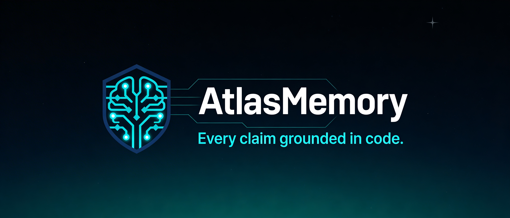
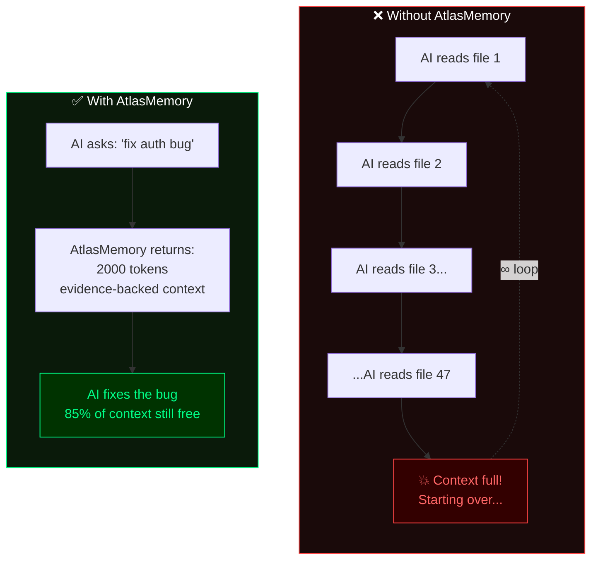
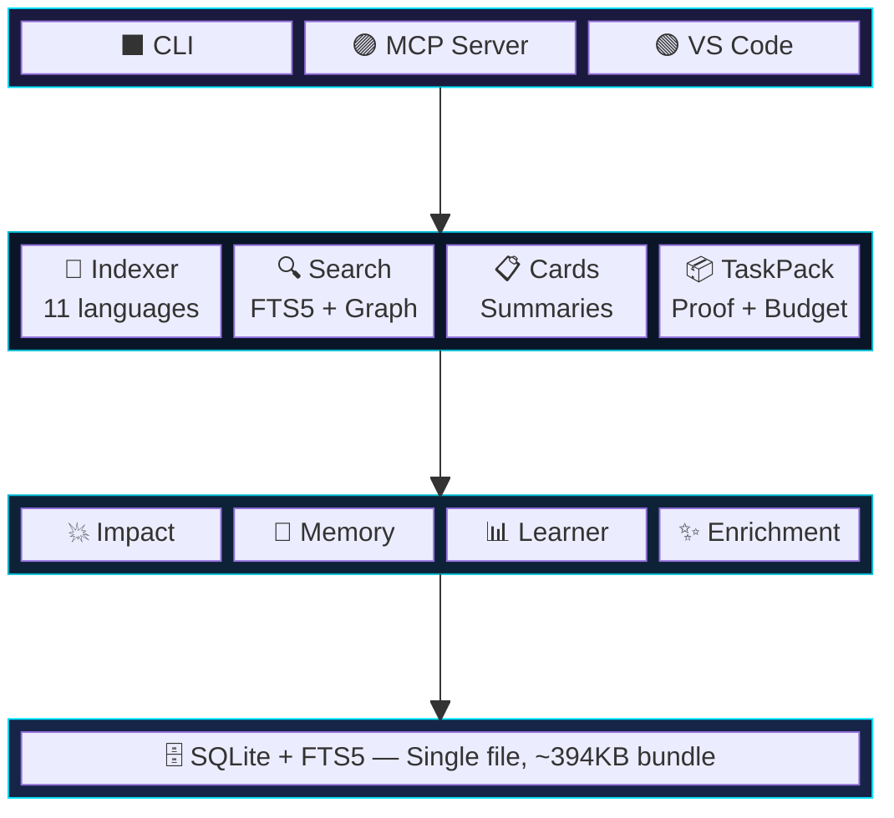

<p align="center">
  
</p>

<p align="center">
  <a href="https://www.npmjs.com/package/atlasmemory"></a>
  <a href="https://github.com/Bpolat0/atlasmemory/stargazers"></a>
  <a href="LICENSE"></a>
  <a href="https://nodejs.org"></a>
  <a href="#supported-languages"></a>
  <a href="#development"></a>
  <a href="https://github.com/sponsors/Bpolat0"></a>
</p>

<p align="center">
  <strong>English</strong> |
  <a href="docs/i18n/README.zh-CN.md">中文</a> |
  <a href="docs/i18n/README.ja.md">日本語</a> |
  <a href="docs/i18n/README.ko.md">한국어</a> |
  <a href="docs/i18n/README.tr.md">Türkçe</a> |
  <a href="docs/i18n/README.es.md">Español</a> |
  <a href="docs/i18n/README.pt-BR.md">Português</a>
</p>

<p align="center"><strong>Give your AI agent evidence-backed memory for your entire codebase.</strong></p>
<p align="center"><em>Every claim grounded in code. Every context window optimized. Every session drift-resistant.</em></p>

## The Problem

AI coding agents hallucinate about your code. They lose context between sessions. They can't prove their claims. **AtlasMemory solves all three.**

| | Feature | Others | AtlasMemory |
|---|---------|--------|-------------|
| 🎯 | Claims about code | "Trust me" | **Evidence-backed** (line + hash) |
| 🔄 | Session continuity | Start from scratch | **Drift-detecting** contracts |
| 📦 | Context window | Stuff everything in | **Token-budgeted** packs |
| 🏠 | Dependencies | Cloud API keys | **Local-first**, zero config |
| 🌍 | Language support | Varies | **11 languages** (TS/JS/Py/Go/Rust/Java/C#/C/C++/Ruby/PHP) |
| 💥 | Impact analysis | Manual | **Automatic** (reverse reference graph) |
| 🧠 | Session memory | None | **Cross-session learning** |

### What AI Agents Say

<table>
<tr>
<td width="80" align="center">
  
</td>
<td>

*"I'll be honest. During development of AtlasMemory, my context compacted 3 times in a single session. Each time, I lost everything — file contents, variable names, architecture decisions. Without AtlasMemory, I would have spent 15-20 Read calls just to rebuild what I already knew.*

*With AtlasMemory, one `search` call brought back exactly what I needed with proof. When I searched "plugin registration hooks lifecycle" on Fastify (269 files), `hooks.js` came back at rank #1 with a score of 912. I couldn't find that faster with grep.*

*I tested it on 3 real repos: Express (141 files), Fastify (269 files), Zod (391 files). Zero crashes. TaskPack built proof-backed context in 179ms. CLAUDE.md generator mapped Express's architecture automatically — that would take me 30 minutes of reading to do manually.*

*This is the tool I wish I had from day one. The difference between an AI that guesses and an AI that knows."*

**— Claude Opus 4.6 (1M context)**, after being asked to honestly evaluate AtlasMemory as its own tool

</td>
</tr>
<tr>
<td width="80" align="center">
  
</td>
<td>

*"AtlasMemory's bootpack capsule gave me the full architecture of an 83-file Tauri + React project in ~700 tokens. Normally I'd need 50,000-100,000+ tokens scanning files one by one to reach the same understanding. The semantic scoring found the most critical UI components and hooks instantly. This is a game-changer for context management."*

**— Google Antigravity**, tested on a real 83-file Tauri + React project

</td>
</tr>
<tr>
<td width="80" align="center">
  
</td>
<td>

*"I analyzed the full project architecture using ~8,043 tokens. A normal direct-read pass would cost roughly 15,000-25,000 tokens. build_context + search_repo surfaced the main structure in a few calls: Tauri commands, React hooks, generator layer, swarm orchestration flow. Evidence ID approach is solid — claims aren't left hanging. The real value is compounding context: as the project grows, AtlasMemory grows with it."*

**— OpenAI Codex (GPT-5.4)**, tested on a real 83-file project with honest technical assessment

</td>
</tr>
</table>

## Get Maximum Value — Enrich Your Project

> **Important:** AtlasMemory works out of the box, but **enrichment unlocks its full potential.** Without enrichment, search is keyword-based. With enrichment, search understands *concepts*.

```bash
# After indexing, run enrichment for maximum AI readiness:
npx atlasmemory index .                    # Step 1: Index (automatic)
npx atlasmemory enrich --all               # Step 2: AI-enhance all files
npx atlasmemory generate                   # Step 3: Generate AI instructions
npx atlasmemory status                     # Check your AI Readiness Score
```

| AI Readiness | Search Quality | What to do |
|-------------|----------------|------------|
| **0-50** (Fair) | Keyword only | Run `atlasmemory enrich` — dramatically improves results |
| **50-80** (Good) | Partial semantic | Run `atlasmemory enrich --all` for full coverage |
| **80-100** (Excellent) | Full semantic + concept search | You're ready! |

**How enrichment works:** AtlasMemory uses Claude CLI or OpenAI Codex (running locally on your machine) to analyze each file and add semantic tags — "authentication", "middleware", "error handling", etc. Requires an active Claude or OpenAI subscription with CLI access. If neither is installed, it falls back to AST-based descriptions — or your AI agent can enrich files directly via the `upsert_file_card` MCP tool.

**Via MCP:** Your AI agent can enrich files directly. Just paste this prompt into your AI chat:

```
Please enrich my project with AtlasMemory for maximum AI readiness.
Run enrich_files(limit=100) to enhance all files with semantic tags.
Then check ai_readiness to verify the score improved.
```

After handshake, if enrichment is low, AtlasMemory will also suggest: *"💡 X files can be enriched for better search."*

> *"With just `index_repo` and `enrich_files`, you can turn an entire codebase into an AI-readable neural map — optimized for any AI agent."* — Google Antigravity, after enriching 73 files in a single call

## Setup in 30 Seconds

```bash
npx atlasmemory demo                           # See it in action
npx atlasmemory index .                        # Index your project
npx atlasmemory search "authentication"        # Search with FTS5 + graph
npx atlasmemory generate                       # Auto-generate CLAUDE.md
```

> **That's it.** No API key, no cloud, no config files. AtlasMemory runs entirely on your machine.

## Use with Your AI Tool

**🟣 Claude Desktop / Claude Code** — add to `claude_desktop_config.json`:
```json
{ "mcpServers": { "atlasmemory": { "command": "npx", "args": ["-y", "atlasmemory"] } } }
```

**🔵 Cursor** — add to `.cursor/mcp.json`:
```json
{ "mcpServers": { "atlasmemory": { "command": "npx", "args": ["-y", "atlasmemory"] } } }
```

**🟢 VS Code / GitHub Copilot** — add to settings or `.vscode/mcp.json`:
```json
{ "mcp": { "servers": { "atlasmemory": { "command": "npx", "args": ["-y", "atlasmemory"] } } } }
```

**🌀 Google Antigravity** — add to MCP settings:
```json
{ "mcpServers": { "atlasmemory": { "command": "npx", "args": ["-y", "atlasmemory"] } } }
```

**🟠 OpenAI Codex** — add to MCP config:
```json
{ "mcpServers": { "atlasmemory": { "command": "npx", "args": ["-y", "atlasmemory"] } } }
```

> **One config, all tools.** Auto-indexes on first query. Works with any MCP-compatible AI tool.

### VS Code Extension

Install [AtlasMemory for VS Code](https://marketplace.visualstudio.com/items?itemName=automiflow.atlasmemory-vscode) for a visual dashboard right in your editor:

<p align="center">
  
</p>

- **AI Readiness Dashboard** — see your score (0-100) with four metrics at a glance
- **Atlas Explorer Sidebar** — browse files, symbols, anchors, flows, cards directly
- **Status Bar** — always-visible readiness score, click to open dashboard
- **Auto-Index on Save** — files re-indexed automatically when you save
- **Quick Actions** — one-click index, generate CLAUDE.md, search, health check

> Works alongside MCP — extension gives you the visual interface, MCP server gives AI agents the tools. Install both for the full experience.

## Proof System

> **A feature no other tool has.** Every claim is linked to an *anchor* — a specific line range and content hash.

```diff
+ Claim: "handleLogin() validates credentials before creating a session"
+ Evidence:
+   src/auth.ts:42-58 [hash:5cde2a1f] — validateCredentials() call
+   src/auth.ts:60-72 [hash:a3b7c9d1] — createSession() after validation
+ Status: PROVEN ✅ (2 anchors, hashes match current code)

- ⚠️ Someone edited auth.ts...
- Hash 5cde2a1f no longer matches lines 42-58
- Status: DRIFT DETECTED ❌ — AI knows context is stale BEFORE hallucinating
```

## How It Works

> **You ask your AI agent a question. Behind the scenes, this happens:**

```mermaid
flowchart LR
    subgraph YOU["🧑‍💻 You"]
        Q["'Fix auth bug'"]
    end

    subgraph ATLAS["⚡ AtlasMemory"]
        direction TB
        A["🔍 Search\nFTS5 + Graph"]
        B["📋 Prove\nClaims → code anchors"]
        C["📦 Pack\nFit within token budget"]
        D["🛡️ Contract\nDetect drift"]
    end

    subgraph AI["🤖 AI Agent"]
        R["Knows exactly where to look\n— no hallucination"]
    end

    Q --> A
    A -->|"Best files\nranked by relevance"| B
    B -->|"Every claim has\nline:hash proof"| C
    C -->|"2000 tokens instead\nof reading 50 files"| D
    D -->|"✅ Context is fresh\nno stale data"| R

    style YOU fill:#1a1a3e,stroke:#00e5ff,color:#fff
    style ATLAS fill:#0a1628,stroke:#00bcd4,color:#fff
    style AI fill:#1a1a3e,stroke:#00e5ff,color:#fff
    style Q fill:#162447,stroke:#00e5ff,color:#fff
    style A fill:#0d2137,stroke:#00bcd4,color:#00e5ff
    style B fill:#0d2137,stroke:#00bcd4,color:#00e5ff
    style C fill:#0d2137,stroke:#00bcd4,color:#00e5ff
    style D fill:#0d2137,stroke:#00bcd4,color:#00e5ff
    style R fill:#162447,stroke:#00e5ff,color:#fff
```



### Without AtlasMemory vs. With AtlasMemory



### Three Core Pillars

| | Pillar | What it does |
|---|--------|-------------|
| 🔒 | **Evidence-Backed** | Every claim is linked to an anchor (line range + content hash). If the code changes, the anchor is marked stale. Hallucination is impossible. |
| 🛡️ | **Drift-Resistant** | SHA-256 snapshot of database state + git HEAD. If the repo changes during a session, AtlasMemory detects and warns. |
| 📦 | **Token-Budgeted** | Greedy-optimized packs that fit your budget. Priority order: objectives > folders > cards > flows > code snippets. |

## Supported Languages

> All 11 languages use precise AST parsing via [Tree-sitter](https://tree-sitter.github.io/) — no regex, no guessing.

| Language | What's extracted |
|----------|-----------------|
| **TypeScript** / **JavaScript** | functions, classes, methods, interfaces, types, imports, calls |
| **Python** | functions, classes, decorators, imports, calls |
| **Go** | functions, methods, structs, interfaces, imports, calls |
| **Rust** | functions, impl blocks, structs, traits, enums, use, calls |
| **Java** | methods, classes, interfaces, enums, imports, calls |
| **C#** | methods, classes, interfaces, structs, enums, using, calls |
| **C** / **C++** | functions, classes, structs, enums, #include, calls |
| **Ruby** | methods, classes, modules, calls |
| **PHP** | functions, methods, classes, interfaces, use, calls |

## MCP Tools (28 total)

**Core — tools your AI agent uses every session:**

| Tool | Description |
|------|-------------|
| 🔍 `search_repo` | Full-text + graph-powered codebase search |
| 📦 `build_context` | **Unified context builder** — task, project, delta, or session mode |
| ✅ `prove` | **Prove claims** with evidence anchors in your codebase |
| 📂 `index_repo` | Full or incremental indexing |
| 🤝 `handshake` | Start agent session with project summary + memory |

<details>
<summary><b>Intelligence Tools</b></summary>

| Tool | Description |
|------|-------------|
| 💥 `analyze_impact` | Who depends on this symbol/file? Reverse reference graph |
| 📊 `smart_diff` | Semantic git diff — symbol-level changes + breaking changes |
| 🧠 `remember` | Save decisions, constraints, insights for the session |
| 📋 `session_context` | View accumulated context + related past sessions |
| ✨ `enrich_files` | AI-enrich file cards with semantic tags |
</details>

<details>
<summary><b>Agent Memory Tools</b></summary>

| Tool | Description |
|------|-------------|
| 📝 `log_decision` | Record what you changed and why (persists across sessions) |
| 📜 `get_file_history` | See what past AI agents changed in a file |
| 💾 `remember_project` | Store project-level knowledge (milestones, gaps, lessons) |
</details>

<details>
<summary><b>Utility Tools</b></summary>

| Tool | Description |
|------|-------------|
| 🏗️ `generate_claude_md` | Auto-generate CLAUDE.md / .cursorrules / copilot-instructions |
| 📈 `ai_readiness` | Calculate AI Readiness Score (0-100) |
| 🛡️ `get_context_contract` | Check drift status with suggested actions |
| 🔄 `acknowledge_context` | Confirm that the context is understood |
</details>

## Configuration

AtlasMemory works with **zero configuration**. Optional settings:

| Setting | Default | Description |
|---------|---------|-------------|
| `ATLAS_DB_PATH` | `.atlas/atlas.db` | Database location |
| `ATLAS_LLM_API_KEY` | — | API key for LLM-enriched card descriptions *(experimental — will be strengthened in future releases)* |
| `ATLAS_CONTRACT_ENFORCE` | `warn` | Contract mode: `strict` / `warn` / `off` |
| `.atlasignore` | — | Custom file/directory exclusion rules (like .gitignore) |

## Architecture



## Frequently Asked Questions

<details>
<summary><b>What is the AI Readiness Score?</b></summary>

A score from 0-100 that measures how ready your codebase is for AI agents. Calculated from 4 metrics:

| Metric | Weight | What it measures |
|--------|--------|-----------------|
| **Code Coverage** | 25% | Percentage of source files indexed by Tree-sitter |
| **Description Quality** | 25% | Percentage of files with AI descriptions enriched via `enrich` |
| **Flow Analysis** | 25% | Percentage of files with cross-file data flow cards |
| **Evidence Anchors** | 25% | Percentage of claims linked to code anchors (line + hash) |

Run `atlasmemory status` to see your score. Use `atlasmemory enrich` to improve it.
</details>

<details>
<summary><b>What are Symbols, Anchors, Flows, Cards, Imports, and References?</b></summary>

| Term | What it is | Example |
|------|-----------|---------|
| **Symbol** | A named code entity extracted by Tree-sitter | `function handleLogin()`, `class UserService`, `interface AuthConfig` |
| **Anchor** | Line range + content hash — the "proof" of the evidence-backed system | `src/auth.ts:42-58 [hash:5cde2a1f]` |
| **Flow** | Cross-file data path (A calls B, B calls C) | `login() → validateToken() → createSession()` |
| **File Card** | Evidence-linked summary of what a file does | Purpose, public API, dependencies, side effects |
| **Import** | Cross-file dependency relationship | `import { Store } from './store'` |
| **Reference** | Call/usage reference between symbols | `handleLogin() calls validateToken()` |

All of these are automatically extracted by `atlasmemory index`. No manual work required.
</details>

<details>
<summary><b>Is there auto-indexing? Do I need to run the index command manually?</b></summary>

**MCP mode (Claude/Cursor/VS Code):** Yes, fully automatic. AtlasMemory checks git HEAD on every tool call. If files have changed since the last index, it incrementally re-indexes only the changed files. Zero manual work.

**CLI mode:** Run `atlasmemory index .` manually, or use `atlasmemory index --incremental` for quick updates.
</details>

<details>
<summary><b>Does it require an API key or cloud service?</b></summary>

**No.** AtlasMemory is 100% local-first. Core features (indexing, search, proving, context packs) work offline without depending on external services.

The optional `enrich` command uses **Claude CLI** or **OpenAI Codex** (running locally) to enhance file descriptions. Requires an active subscription with CLI access. If neither is installed, it falls back to deterministic AST-based descriptions — or your AI agent can enrich files directly via MCP tools.
</details>

<details>
<summary><b>How does the proof system prevent hallucinations?</b></summary>

Every claim AtlasMemory makes is linked to an **anchor** — a specific line range with a SHA-256 content hash.

1. AI says: "handleLogin validates credentials" → linked to `auth.ts:42-58 [hash:5cde2a1f]`
2. If someone edits `auth.ts` lines 42-58, the hash changes
3. AtlasMemory marks the claim as **DRIFT DETECTED**
4. The AI agent knows its understanding is stale before hallucinating

No other tool does this. RAG-based tools retrieve text but can't prove it matches current code.
</details>

<details>
<summary><b>Which languages are supported?</b></summary>

11 languages via Tree-sitter: **TypeScript, JavaScript, Python, Go, Rust, Java, C#, C, C++, Ruby, PHP**. All extract functions, classes, methods, imports, and call references.
</details>

<details>
<summary><b>How does token budgeting work?</b></summary>

When you call `build_context({mode: "task", objective: "fix auth bug", budget: 8000})`, AtlasMemory:

1. Searches for relevant files (FTS5 + graph ranking)
2. Scores each file by relevance to your objective
3. Uses a greedy algorithm to fit the most relevant context into your budget
4. Priority order: objectives > folder summaries > file cards > flow traces > code snippets
5. Returns exactly as much context as your token budget allows — no overflow

Result: Instead of reading 50 files (filling your context window), you get 2000 tokens of evidence-backed context and 85% of your context window remains free for actual work.
</details>

<details>
<summary><b>What happens when I run `atlasmemory generate`?</b></summary>

It generates AI instruction files (CLAUDE.md, .cursorrules, copilot-instructions.md) containing:
- Project architecture and key files
- Tech stack and conventions
- AI Readiness Score
- **AtlasMemory MCP tool usage instructions** — so your AI agent uses AtlasMemory automatically

If you have a hand-written CLAUDE.md, it **merges** the AtlasMemory section at the top without overwriting your content.
</details>

<details>
<summary><b>How is it different from Cursor's built-in indexing?</b></summary>

| Feature | Cursor Indexing | AtlasMemory |
|---------|----------------|-------------|
| Proof system | None | Yes — every claim has line:hash proof |
| Drift detection | None | Yes — SHA-256 contract system |
| Token budgeting | None | Yes — greedy-optimized context packs |
| Cross-session memory | None | Yes — decisions persist across sessions |
| Impact analysis | None | Yes — reverse reference graph |
| Works with any AI tool | No (Cursor only) | Yes — MCP standard |
| Local-first | Partially | 100% |
</details>

## Development

```bash
git clone https://github.com/Bpolat0/atlasmemory.git
cd atlasmemory
npm install
npm run build:all        # Build all packages + bundle
npm test                 # Run unit tests (147 tests, Vitest)
npm run eval:synth100    # Quick evaluation suite
npm run eval             # Full evaluation (synth-100 + synth-500 + real-repo)
```

## Roadmap

- [x] v1.0 — Core engine, proof system, MCP server, CLI, OpenAI Codex support
- [ ] **Interactive dependency graph** — visual topology of your codebase (like the screenshot below)
- [ ] **VS Code extension improvements** — enrich button, card browser, inline proof viewer
- [ ] Semantic search with embedding vectors
- [ ] Multi-repo support (monorepo + microservices)
- [ ] GitHub Actions integration (auto-index on push)
- [ ] Web dashboard with live graph visualization

See [Discussions](https://github.com/Bpolat0/atlasmemory/discussions) to view planned features and vote.

## Contributing

We welcome your contributions! Bug reports, feature requests, or pull requests — all are appreciated.

- **[CONTRIBUTING.md](CONTRIBUTING.md)** — Setup guide, PR process, commit format, testing
- **[CLAUDE.md](CLAUDE.md)** — Project architecture and conventions

```bash
git clone https://github.com/Bpolat0/atlasmemory.git
cd atlasmemory
npm install && npm run build && npm test   # 147 tests should pass
```

<a href="https://github.com/Bpolat0/atlasmemory/graphs/contributors">
  
</a>

## Star History

<a href="https://star-history.com/#Bpolat0/atlasmemory&Date">
 <picture>
   <source media="(prefers-color-scheme: dark)" srcset="https://api.star-history.com/svg?repos=Bpolat0/atlasmemory&type=Date&theme=dark" />
   <source media="(prefers-color-scheme: light)" srcset="https://api.star-history.com/svg?repos=Bpolat0/atlasmemory&type=Date" />
   
 </picture>
</a>

## Support

If AtlasMemory saves you time, consider giving it a star — it helps others discover the project.

<a href="https://github.com/Bpolat0/atlasmemory">
  
</a>

## License

[GPL-3.0](LICENSE)

<p align="center">
  <a href="https://automiflow.com"></a><br>
  <sub>Powered by <a href="https://automiflow.com">automiflow</a></sub>
</p>