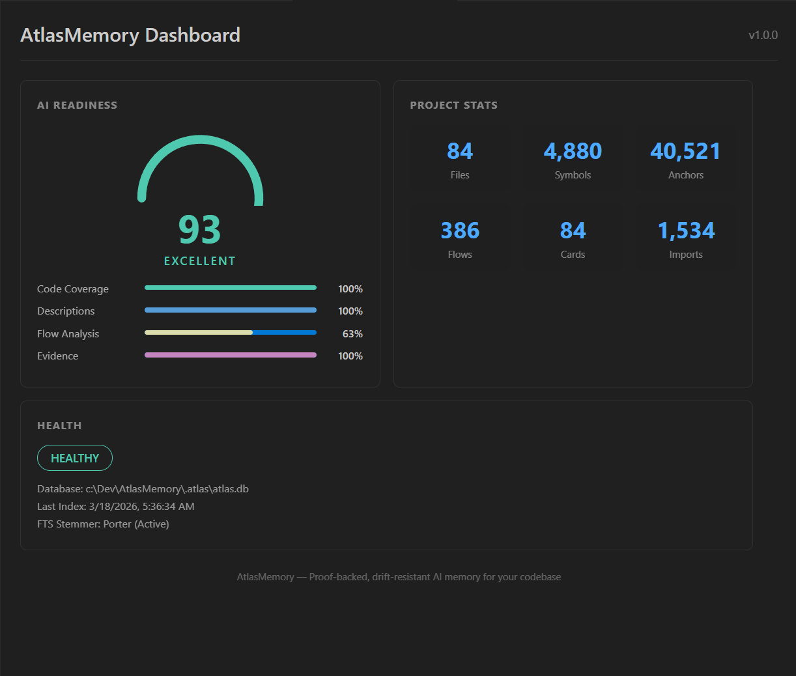
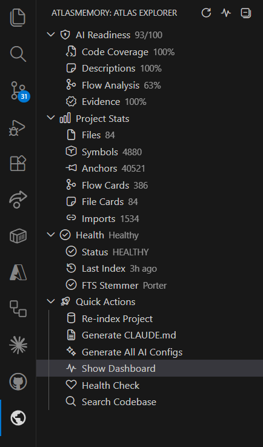

# AtlasMemory for VS Code

**Proof-backed AI memory for your codebase — right in your editor.**





## Features

### AI Readiness Dashboard
See your project's AI readiness score at a glance. Four metrics tracked in real-time:
- **Code Coverage** — % of files indexed
- **Description Quality** — % of files with AI-enriched descriptions
- **Flow Analysis** — cross-file data flow coverage
- **Evidence Anchors** — % of claims linked to code proof

### Atlas Explorer Sidebar
Browse your project's AI memory directly in the sidebar:
- AI Readiness score breakdown
- Project statistics (files, symbols, anchors, flows, cards, imports)
- Health status and diagnostics
- Quick actions — one click to index, generate, search

### Status Bar
Always-visible AI Readiness score in your status bar. Click to open the dashboard.

### Auto-Index on Save
Files are automatically re-indexed when you save. No manual commands needed. Configurable debounce delay.

## Commands

| Command | Description |
|---------|-------------|
| `AtlasMemory: Index Project` | Index or re-index your entire project |
| `AtlasMemory: Generate CLAUDE.md` | Generate AI instruction file for Claude |
| `AtlasMemory: Generate All AI Configs` | Generate CLAUDE.md + .cursorrules + copilot-instructions |
| `AtlasMemory: Show Dashboard` | Open the AI Readiness dashboard |
| `AtlasMemory: Health Check` | Run diagnostics on your AtlasMemory database |
| `AtlasMemory: Search Codebase` | Full-text + graph-boosted code search |
| `AtlasMemory: Refresh Status` | Refresh sidebar and status bar |

## Requirements

- **Node.js 18+**
- **AtlasMemory** npm package: `npm install -g atlasmemory`

The extension automatically detects the `atlasmemory` binary. If installed globally, it just works. You can also set a custom path in settings.

## Settings

| Setting | Default | Description |
|---------|---------|-------------|
| `atlasmemory.binaryPath` | (auto-detect) | Custom path to atlasmemory binary |
| `atlasmemory.autoIndexOnSave` | `true` | Auto re-index files on save |
| `atlasmemory.watchDebounceMs` | `2000` | Debounce delay for auto-index (ms) |
| `atlasmemory.statusBarEnabled` | `true` | Show AI Readiness in status bar |

## How It Works

AtlasMemory indexes your codebase using Tree-sitter (11 languages), stores everything in a local SQLite database, and provides proof-backed context to AI agents. The VS Code extension gives you a visual interface to monitor and manage this process.

```
Your Code → Tree-sitter → SQLite + FTS5 → AI-Ready Context
                                              ↓
                           Dashboard ← Extension ← Status Bar
```

**Works alongside MCP.** The extension provides the visual interface while the MCP server provides tools to Claude, Cursor, and Copilot. Install both for the full experience.

## Links

- [AtlasMemory on npm](https://www.npmjs.com/package/atlasmemory)
- [GitHub Repository](https://github.com/Bpolat0/atlasmemory)
- [Documentation](https://github.com/Bpolat0/atlasmemory#readme)

## License

[GPL-3.0](LICENSE)
