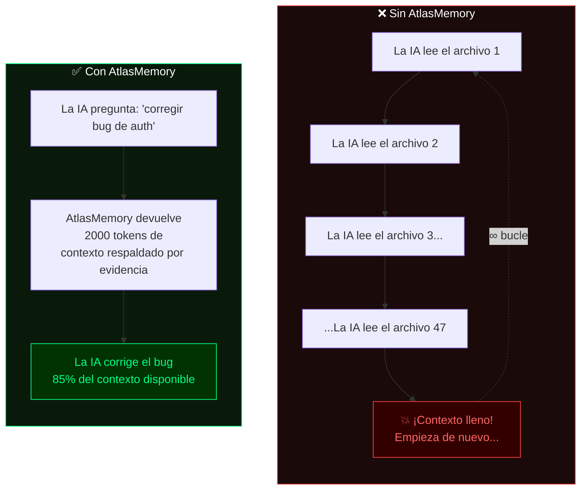
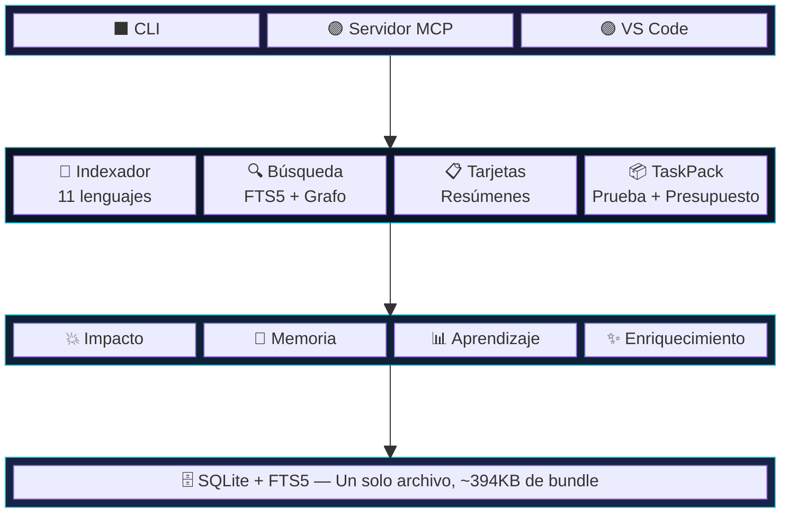

<p align="center">
  
</p>

<p align="center">
  <a href="https://www.npmjs.com/package/atlasmemory"></a>
  <a href="https://github.com/Bpolat0/atlasmemory/stargazers"></a>
  <a href="../../LICENSE"></a>
  <a href="https://nodejs.org"></a>
  <a href="#lenguajes-soportados"></a>
  <a href="#desarrollo"></a>
</p>

<p align="center">
  <a href="../../README.md">English</a> ·
  <a href="README.zh-CN.md">中文</a> ·
  <a href="README.ja.md">日本語</a> ·
  <a href="README.ko.md">한국어</a> ·
  <a href="README.tr.md">Türkçe</a> ·
  <strong>Español</strong> ·
  <a href="README.pt-BR.md">Português</a>
</p>

<p align="center"><strong>Dale a tu agente de IA memoria respaldada por evidencia de todo tu código.</strong></p>
<p align="center"><em>Cada afirmación fundamentada en el código. Cada ventana de contexto optimizada. Cada sesión libre de deriva.</em></p>

## El Problema

Los agentes de codificación con IA alucinan sobre tu código. Pierden el contexto entre sesiones. No pueden demostrar sus afirmaciones. **AtlasMemory resuelve los tres problemas.**

| | Característica | Otros | AtlasMemory |
|---|----------------|-------|-------------|
| 🎯 | Afirmaciones sobre el código | "Confía en mí" | **Respaldadas por evidencia** (línea + hash) |
| 🔄 | Continuidad de sesión | Empezar de cero | **Contratos con detección de deriva** |
| 📦 | Ventana de contexto | Volcar todo | **Paquetes con presupuesto de tokens** |
| 🏠 | Dependencias | Claves API en la nube | **Local-first**, cero configuración |
| 🌍 | Lenguajes | Varía | **11 lenguajes** (TS/JS/Py/Go/Rust/Java/C#/C/C++/Ruby/PHP) |
| 💥 | Análisis de impacto | Manual | **Automático** (grafo de referencias inversas) |
| 🧠 | Memoria de sesión | Ninguna | **Aprendizaje entre sesiones** |

## Configuración en 30 Segundos

```bash
npx atlasmemory demo                           # Míralo en acción
npx atlasmemory index .                        # Indexa tu proyecto
npx atlasmemory search "autenticación"         # Búsqueda con FTS5 + grafo
npx atlasmemory generate                       # Auto-genera CLAUDE.md
```

> **Eso es todo.** Sin claves API, sin nube, sin archivos de configuración. AtlasMemory se ejecuta completamente en tu máquina.

## Úsalo con tu Herramienta de IA

**🟣 Claude Desktop / Claude Code** — agrega a `claude_desktop_config.json`:
```json
{ "mcpServers": { "atlasmemory": { "command": "npx", "args": ["-y", "atlasmemory"], "cwd": "/ruta/a/tu/proyecto" } } }
```

**🔵 Cursor** — agrega a `.cursor/mcp.json`:
```json
{ "mcpServers": { "atlasmemory": { "command": "npx", "args": ["-y", "atlasmemory"] } } }
```

**🟢 VS Code** — agrega en la configuración:
```json
{ "mcp": { "servers": { "atlasmemory": { "command": "npx", "args": ["-y", "atlasmemory"] } } } }
```

> Se auto-indexa en la primera consulta. Cero configuración. Compatible con cualquier herramienta de IA que soporte MCP.

## El Sistema de Pruebas

> **Lo que nadie más tiene.** Cada afirmación se vincula a un *ancla* — un rango de líneas específico con un hash de contenido.

```diff
+ Afirmación: "handleLogin() valida credenciales antes de crear la sesión"
+ Evidencia:
+   src/auth.ts:42-58 [hash:5cde2a1f] — llamada a validateCredentials()
+   src/auth.ts:60-72 [hash:a3b7c9d1] — createSession() después de la validación
+ Estado: DEMOSTRADO ✅ (2 anclas, los hashes coinciden con el código actual)

- ⚠️ Alguien edita auth.ts...
- El hash 5cde2a1f ya no coincide con las líneas 42-58
- Estado: DERIVA DETECTADA ❌ — La IA sabe que el contexto está desactualizado ANTES de alucinar
```

## Cómo Funciona

> **Le haces una pregunta a tu agente de IA. Esto es lo que sucede detrás de escena:**

```mermaid
flowchart LR
    subgraph YOU["🧑‍💻 Tú"]
        Q["'Corrige el bug de auth'"]
    end

    subgraph ATLAS["⚡ AtlasMemory"]
        direction TB
        A["🔍 Búsqueda\nFTS5 + Grafo"]
        B["📋 Prueba\nVincular afirmaciones → anclas de código"]
        C["📦 Empaquetar\nAjustar al presupuesto de tokens"]
        D["🛡️ Contrato\nDetectar deriva"]
    end

    subgraph AI["🤖 Agente de IA"]
        R["Sabe exactamente dónde buscar\n— sin alucinaciones"]
    end

    Q --> A
    A -->|"Archivos principales\nclasificados por relevancia"| B
    B -->|"Cada afirmación tiene\nevidencia línea:hash"| C
    C -->|"2000 tokens en vez\nde leer 50 archivos"| D
    D -->|"✅ Contexto actualizado\nsin datos obsoletos"| R

    style YOU fill:#1a1a3e,stroke:#00e5ff,color:#fff
    style ATLAS fill:#0a1628,stroke:#00bcd4,color:#fff
    style AI fill:#1a1a3e,stroke:#00e5ff,color:#fff
    style Q fill:#162447,stroke:#00e5ff,color:#fff
    style A fill:#0d2137,stroke:#00bcd4,color:#00e5ff
    style B fill:#0d2137,stroke:#00bcd4,color:#00e5ff
    style C fill:#0d2137,stroke:#00bcd4,color:#00e5ff
    style D fill:#0d2137,stroke:#00bcd4,color:#00e5ff
    style R fill:#162447,stroke:#00e5ff,color:#fff
```



### Sin AtlasMemory vs Con AtlasMemory



### Los Tres Pilares

| | Pilar | Qué hace |
|---|-------|----------|
| 🔒 | **Respaldado por Evidencia** | Cada afirmación se vincula a un ancla (rango de líneas + hash de contenido). ¿Cambió el código? El ancla se marca como obsoleta. Sin alucinaciones. |
| 🛡️ | **Resistente a la Deriva** | Instantáneas SHA-256 del estado de la BD + git HEAD. ¿El repositorio cambia durante la sesión? AtlasMemory lo detecta y advierte. |
| 📦 | **Presupuesto de Tokens** | Paquetes de contexto optimizados con algoritmo greedy. Prioridad: objetivos > carpetas > tarjetas > flujos > fragmentos de código. |

## Lenguajes Soportados

> Los 11 lenguajes usan [Tree-sitter](https://tree-sitter.github.io/) para análisis AST preciso — sin regex, sin adivinanzas.

| Lenguaje | Extrae |
|----------|--------|
| **TypeScript** / **JavaScript** | funciones, clases, métodos, interfaces, tipos, importaciones, llamadas |
| **Python** | funciones, clases, decoradores, importaciones, llamadas |
| **Go** | funciones, métodos, structs, interfaces, importaciones, llamadas |
| **Rust** | funciones, bloques impl, structs, traits, enums, use, llamadas |
| **Java** | métodos, clases, interfaces, enums, importaciones, llamadas |
| **C#** | métodos, clases, interfaces, structs, enums, using, llamadas |
| **C** / **C++** | funciones, clases, structs, enums, #include, llamadas |
| **Ruby** | métodos, clases, módulos, llamadas |
| **PHP** | funciones, métodos, clases, interfaces, use, llamadas |

## Herramientas MCP (28 en total)

**Principales — lo que tu agente de IA usa en cada sesión:**

| Herramienta | Descripción |
|-------------|-------------|
| 🔍 `search_repo` | Búsqueda full-text + potenciada por grafo en el código |
| 📦 `build_context` | **Constructor de contexto unificado** — modo tarea, proyecto, delta o sesión |
| ✅ `prove` | **Demostrar afirmaciones** con anclas de evidencia del código |
| 📂 `index_repo` | Indexación completa o incremental |
| 🤝 `handshake` | Inicializar sesión del agente con resumen del proyecto + memoria |

<details>
<summary><b>Herramientas de Inteligencia</b></summary>

| Herramienta | Descripción |
|-------------|-------------|
| 💥 `analyze_impact` | ¿Quién depende de este símbolo/archivo? Grafo de referencias inversas |
| 📊 `smart_diff` | Diff semántico de git — cambios a nivel de símbolo + cambios que rompen compatibilidad |
| 🧠 `remember` | Registrar decisiones, restricciones e insights para la sesión |
| 📋 `session_context` | Ver contexto acumulado + sesiones anteriores relacionadas |
| ✨ `enrich_files` | Mejorar tarjetas de archivos con etiquetas semánticas mediante IA |
</details>

<details>
<summary><b>Herramientas de Memoria del Agente</b></summary>

| Herramienta | Descripción |
|-------------|-------------|
| 📝 `log_decision` | Registrar qué cambiaste y por qué (persiste entre sesiones) |
| 📜 `get_file_history` | Ver qué agentes de IA anteriores cambiaron en un archivo |
| 💾 `remember_project` | Almacenar conocimiento a nivel de proyecto (hitos, brechas, aprendizajes) |
</details>

<details>
<summary><b>Herramientas de Utilidad</b></summary>

| Herramienta | Descripción |
|-------------|-------------|
| 🏗️ `generate_claude_md` | Auto-generar CLAUDE.md / .cursorrules / copilot-instructions |
| 📈 `ai_readiness` | Calcular la Puntuación de Preparación para IA (0-100) |
| 🛡️ `get_context_contract` | Verificar estado de deriva con acciones recomendadas |
| 🔄 `acknowledge_context` | Confirmar que el contexto ha sido comprendido |
</details>

## Configuración

AtlasMemory funciona con **cero configuración**. Opciones opcionales:

| Configuración | Por defecto | Descripción |
|---------------|-------------|-------------|
| `ATLAS_DB_PATH` | `.atlas/atlas.db` | Ubicación de la base de datos |
| `ATLAS_LLM_API_KEY` | — | Clave API para descripciones de tarjetas mejoradas con LLM |
| `ATLAS_CONTRACT_ENFORCE` | `warn` | Modo de contrato: `strict` / `warn` / `off` |
| `.atlasignore` | — | Exclusiones personalizadas de archivos/directorios (como .gitignore) |

## Arquitectura



## Preguntas Frecuentes

<details>
<summary><b>¿Qué es la Puntuación de Preparación para IA?</b></summary>

Una puntuación de 0 a 100 que mide qué tan bien preparado está tu código para agentes de IA. Se calcula a partir de 4 métricas:

| Métrica | Peso | Qué mide |
|---------|------|----------|
| **Cobertura de Código** | 25% | % de archivos fuente indexados por Tree-sitter |
| **Calidad de Descripciones** | 25% | % de archivos con descripciones de IA enriquecidas (mediante `enrich`) |
| **Análisis de Flujo** | 25% | % de archivos con tarjetas de flujo de datos entre archivos |
| **Anclas de Evidencia** | 25% | % de afirmaciones vinculadas a anclas de código (línea + hash) |

Ejecuta `atlasmemory status` para ver tu puntuación. Ejecuta `atlasmemory enrich` para mejorarla.
</details>

<details>
<summary><b>¿Qué son Símbolos, Anclas, Flujos, Tarjetas, Importaciones y Referencias?</b></summary>

| Término | Qué es | Ejemplo |
|---------|--------|---------|
| **Símbolo** | Una entidad de código con nombre extraída por Tree-sitter | `function handleLogin()`, `class UserService`, `interface AuthConfig` |
| **Ancla** | Un rango de líneas + hash de contenido — la "prueba" en respaldado por evidencia | `src/auth.ts:42-58 [hash:5cde2a1f]` |
| **Flujo** | Una ruta de datos entre archivos (A llama a B que llama a C) | `login() → validateToken() → createSession()` |
| **Tarjeta de Archivo** | Un resumen de lo que hace un archivo, con enlaces a evidencia | Propósito, API pública, dependencias, efectos secundarios |
| **Importación** | Una relación de dependencia entre archivos | `import { Store } from './store'` |
| **Referencia** | Una referencia de llamada/uso entre símbolos | `handleLogin() llama a validateToken()` |

Todos se extraen automáticamente con `atlasmemory index`. No se requiere trabajo manual.
</details>

<details>
<summary><b>¿Se auto-indexa? ¿Necesito ejecutar index manualmente?</b></summary>

**Modo MCP (Claude/Cursor/VS Code):** Sí, completamente automático. AtlasMemory verifica git HEAD en cada llamada a herramienta. Si los archivos cambiaron desde la última indexación, re-indexa incrementalmente solo los archivos modificados. Cero trabajo manual.

**Modo CLI:** Ejecuta `atlasmemory index .` manualmente, o usa `atlasmemory index --incremental` para actualizaciones rápidas.
</details>

<details>
<summary><b>¿Necesita una clave API o un servicio en la nube?</b></summary>

**No.** AtlasMemory es 100% local-first. Las funciones principales (indexación, búsqueda, pruebas, paquetes de contexto) funcionan sin conexión, sin dependencias de servicios externos.

El comando opcional `enrich` usa **Claude CLI** (gratis, local) u **OpenAI Codex** (gratis, local) para mejorar las descripciones de archivos. Si ninguno está instalado, recurre a descripciones determinísticas basadas en AST — sigue siendo funcional, solo menos detallado.
</details>

<details>
<summary><b>¿Cómo previene las alucinaciones el sistema de pruebas?</b></summary>

Cada afirmación que hace AtlasMemory está vinculada a un **ancla** — un rango de líneas específico con un hash de contenido SHA-256.

1. La IA dice: "handleLogin valida credenciales" → vinculado a `auth.ts:42-58 [hash:5cde2a1f]`
2. Si alguien edita las líneas 42-58 de `auth.ts`, el hash cambia
3. AtlasMemory marca la afirmación como **DERIVA DETECTADA**
4. El agente de IA sabe que su comprensión está desactualizada — antes de alucinar

Ninguna otra herramienta hace esto. Las herramientas basadas en RAG recuperan texto pero no pueden demostrar que coincide con el código actual.
</details>

<details>
<summary><b>¿Qué lenguajes están soportados?</b></summary>

11 lenguajes mediante Tree-sitter: **TypeScript, JavaScript, Python, Go, Rust, Java, C#, C, C++, Ruby, PHP**. Todos extraen funciones, clases, métodos, importaciones y referencias de llamadas.
</details>

<details>
<summary><b>¿Cómo funciona el presupuesto de tokens?</b></summary>

Cuando llamas a `build_context({mode: "task", objective: "corregir bug de auth", budget: 8000})`, AtlasMemory:

1. Busca archivos relevantes (FTS5 + clasificación por grafo)
2. Puntúa cada archivo según su relevancia para tu objetivo
3. Usa un algoritmo greedy para empaquetar el contexto más relevante dentro de tu presupuesto
4. Orden de prioridad: objetivos > resúmenes de carpetas > tarjetas de archivos > trazas de flujo > fragmentos de código
5. Devuelve exactamente la cantidad de contexto que tu presupuesto de tokens permite — sin desbordamiento

Resultado: en vez de leer 50 archivos (llenando tu contexto), obtienes 2000 tokens de contexto respaldado por evidencia con el 85% de tu ventana de contexto disponible para el trabajo real.
</details>

<details>
<summary><b>¿Qué sucede cuando ejecuto `atlasmemory generate`?</b></summary>

Crea archivos de instrucciones para IA (CLAUDE.md, .cursorrules, copilot-instructions.md) con:
- Arquitectura del proyecto y archivos clave
- Stack tecnológico y convenciones
- Puntuación de Preparación para IA
- **Instrucciones de uso de las herramientas MCP de AtlasMemory** — para que tu agente de IA use AtlasMemory automáticamente

Si ya tienes un CLAUDE.md escrito a mano, **fusiona** la sección de AtlasMemory en la parte superior sin sobrescribir tu contenido.
</details>

<details>
<summary><b>¿En qué se diferencia de la indexación integrada de Cursor?</b></summary>

| Característica | Indexación de Cursor | AtlasMemory |
|----------------|---------------------|-------------|
| Sistema de pruebas | No | Sí — cada afirmación tiene evidencia línea:hash |
| Detección de deriva | No | Sí — sistema de contratos SHA-256 |
| Presupuesto de tokens | No | Sí — paquetes de contexto optimizados con greedy |
| Memoria entre sesiones | No | Sí — las decisiones persisten entre sesiones |
| Análisis de impacto | No | Sí — grafo de referencias inversas |
| Funciona con cualquier herramienta de IA | No (solo Cursor) | Sí — estándar MCP |
| Local-first | Parcial | 100% |
</details>

## Desarrollo

```bash
git clone https://github.com/Bpolat0/atlasmemory.git
cd atlasmemory
npm install
npm run build:all        # Compilar todos los paquetes + bundle
npm test                 # Ejecutar tests unitarios (147 tests, Vitest)
npm run eval:synth100    # Suite de evaluación rápida
npm run eval             # Evaluación completa (synth-100 + synth-500 + real-repo)
```

## Hoja de Ruta

- [x] v1.0 — Motor principal, sistema de pruebas, servidor MCP, CLI, soporte para OpenAI Codex
- [ ] **Grafo interactivo de dependencias** — topología visual de tu código (como la captura de pantalla a continuación)
- [ ] **Mejora de la extensión VS Code** — botón de enriquecimiento, explorador de tarjetas, visor de evidencia en línea
- [ ] Búsqueda semántica con embeddings
- [ ] Soporte multi-repositorio (monorepo + microservicios)
- [ ] Integración con GitHub Actions (auto-indexación en push)
- [ ] Panel web con visualización de grafo en vivo

Consulta lo planeado y vota por funcionalidades en [Discusiones](https://github.com/Bpolat0/atlasmemory/discussions).

## Contribuir

¡Damos la bienvenida a las contribuciones! Ya sean reportes de errores, solicitudes de funcionalidades o pull requests.

- **[CONTRIBUTING.md](../../CONTRIBUTING.md)** — Guía de configuración, proceso de PR, formato de commits, pruebas
- **[CLAUDE.md](../../CLAUDE.md)** — Arquitectura del proyecto y convenciones

```bash
git clone https://github.com/Bpolat0/atlasmemory.git
cd atlasmemory
npm install && npm run build && npm test   # 147 tests deberían pasar
```

<a href="https://github.com/Bpolat0/atlasmemory/graphs/contributors">
  
</a>

## Historial de Estrellas

<a href="https://star-history.com/#Bpolat0/atlasmemory&Date">
 <picture>
   <source media="(prefers-color-scheme: dark)" srcset="https://api.star-history.com/svg?repos=Bpolat0/atlasmemory&type=Date&theme=dark" />
   <source media="(prefers-color-scheme: light)" srcset="https://api.star-history.com/svg?repos=Bpolat0/atlasmemory&type=Date" />
   
 </picture>
</a>

## Apoyo

Si AtlasMemory te ahorra tiempo, considera darle una estrella — ayuda a otros a descubrir el proyecto.

<a href="https://github.com/Bpolat0/atlasmemory">
  
</a>

## Licencia

[GPL-3.0](../../LICENSE)

<p align="center">
  <a href="https://automiflow.com"></a><br>
  <sub>Desarrollado con <a href="https://automiflow.com">automiflow</a></sub>
</p>
