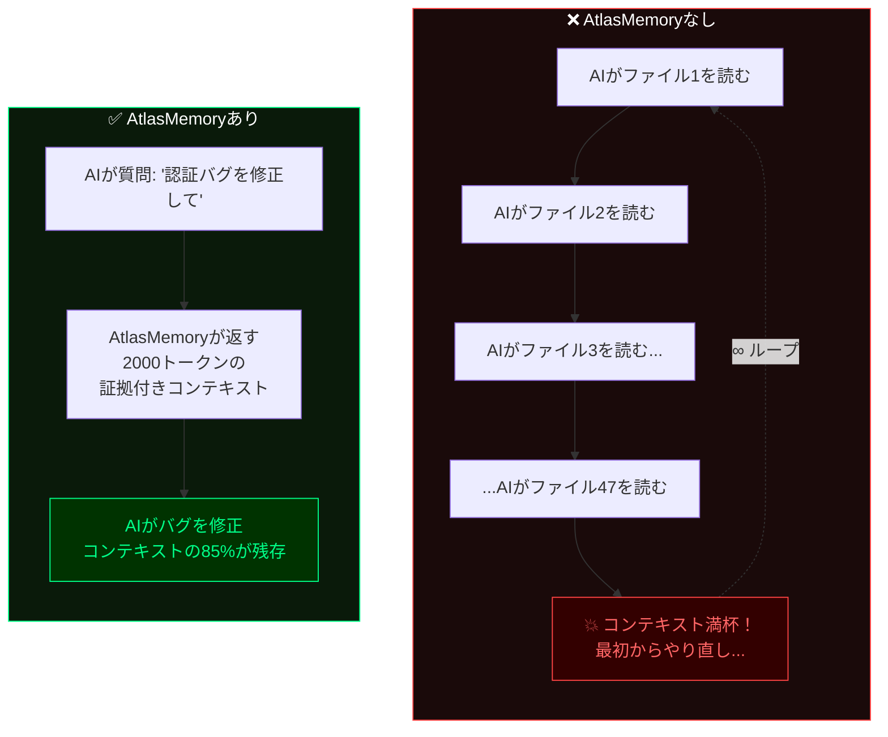
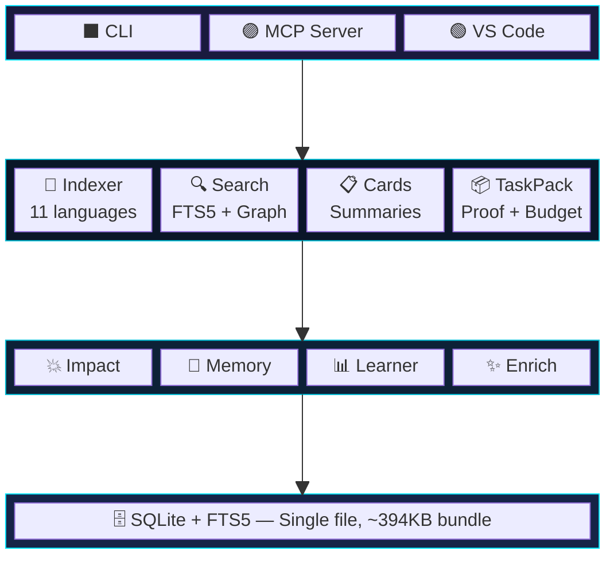

<p align="center">
  
</p>

<p align="center">
  <a href="https://www.npmjs.com/package/atlasmemory"></a>
  <a href="https://github.com/Bpolat0/atlasmemory/stargazers"></a>
  <a href="../../LICENSE"></a>
  <a href="https://nodejs.org"></a>
  <a href="#対応言語"></a>
  <a href="#開発"></a>
  <a href="https://github.com/sponsors/Bpolat0"></a>
</p>

<p align="center">
  <a href="../../README.md">English</a> |
  <a href="README.zh-CN.md">中文</a> |
  <strong>日本語</strong> |
  <a href="README.ko.md">한국어</a> |
  <a href="README.tr.md">Türkçe</a> |
  <a href="README.es.md">Español</a> |
  <a href="README.pt-BR.md">Português</a>
</p>

<p align="center"><strong>AIエージェントにコードベース全体の証拠付きメモリを。</strong></p>
<p align="center"><em>すべての主張はコードに根拠を持ち、コンテキストウィンドウは最適化され、セッション間のドリフトを防止します。</em></p>

## 課題

AIコーディングエージェントはコードについてハルシネーションを起こします。セッション間でコンテキストを失います。主張を証明できません。**AtlasMemoryはこの3つすべてを解決します。**

| | 機能 | 他のツール | AtlasMemory |
|---|------|-----------|-------------|
| 🎯 | コードに関する主張 | 「信じてください」 | **証拠付き**（行番号 + ハッシュ） |
| 🔄 | セッション継続性 | 最初からやり直し | **ドリフト検出**コントラクト |
| 📦 | コンテキストウィンドウ | すべて詰め込み | **トークン予算管理**パック |
| 🏠 | 依存関係 | クラウドAPIキー必須 | **ローカルファースト**、設定不要 |
| 🌍 | 対応言語 | 限定的 | **11言語**（TS/JS/Py/Go/Rust/Java/C#/C/C++/Ruby/PHP） |
| 💥 | 影響分析 | 手動 | **自動**（逆参照グラフ） |
| 🧠 | セッションメモリ | なし | **セッション間学習** |

## 30秒セットアップ

```bash
npx atlasmemory demo                           # デモを実行
npx atlasmemory index .                        # プロジェクトをインデックス
npx atlasmemory search "authentication"        # FTS5 + グラフで検索
npx atlasmemory generate                       # CLAUDE.md を自動生成
```

> **これだけです。** APIキー不要、クラウド不要、設定ファイル不要。AtlasMemoryは完全にローカルマシン上で動作します。

## AIツールとの連携

**🟣 Claude Desktop / Claude Code** — `claude_desktop_config.json` に追加:
```json
{ "mcpServers": { "atlasmemory": { "command": "npx", "args": ["-y", "atlasmemory"], "cwd": "/path/to/your/project" } } }
```

**🔵 Cursor** — `.cursor/mcp.json` に追加:
```json
{ "mcpServers": { "atlasmemory": { "command": "npx", "args": ["-y", "atlasmemory"] } } }
```

**🟢 VS Code** — 設定に追加:
```json
{ "mcp": { "servers": { "atlasmemory": { "command": "npx", "args": ["-y", "atlasmemory"] } } } }
```

> 初回クエリ時に自動インデックス。設定不要。MCP対応のあらゆるAIツールで動作します。

## 証明システム

> **他にはない機能。** すべての主張は*アンカー*にリンクされています — コンテンツハッシュ付きの特定の行範囲です。

```diff
+ 主張: "handleLogin()はセッション作成前に認証情報を検証する"
+ 証拠:
+   src/auth.ts:42-58 [hash:5cde2a1f] — validateCredentials()呼び出し
+   src/auth.ts:60-72 [hash:a3b7c9d1] — 検証後のcreateSession()
+ ステータス: 証明済み ✅（アンカー2件、ハッシュが現在のコードと一致）

- ⚠️ 誰かがauth.tsを編集すると...
- ハッシュ5cde2a1fが42-58行目と一致しなくなる
- ステータス: ドリフト検出 ❌ — AIがハルシネーションを起こす前にコンテキストが古いことを認識
```

## 仕組み

> **AIエージェントに質問すると、裏側では以下が実行されます:**

```mermaid
flowchart LR
    subgraph YOU["🧑‍💻 あなた"]
        Q["'認証バグを修正して'"]
    end

    subgraph ATLAS["⚡ AtlasMemory"]
        direction TB
        A["🔍 検索\nFTS5 + グラフ"]
        B["📋 証明\n主張 → コードアンカーにリンク"]
        C["📦 パッキング\nトークン予算内に収める"]
        D["🛡️ コントラクト\nドリフトを検出"]
    end

    subgraph AI["🤖 AIエージェント"]
        R["どこを見ればいいか正確に把握\n— ハルシネーションなし"]
    end

    Q --> A
    A -->|"関連性順に\nランキングされたファイル"| B
    B -->|"すべての主張に\n行:ハッシュの証拠"| C
    C -->|"50ファイルを読む代わりに\n2000トークン"| D
    D -->|"✅ コンテキストは最新\n古いデータなし"| R

    style YOU fill:#1a1a3e,stroke:#00e5ff,color:#fff
    style ATLAS fill:#0a1628,stroke:#00bcd4,color:#fff
    style AI fill:#1a1a3e,stroke:#00e5ff,color:#fff
    style Q fill:#162447,stroke:#00e5ff,color:#fff
    style A fill:#0d2137,stroke:#00bcd4,color:#00e5ff
    style B fill:#0d2137,stroke:#00bcd4,color:#00e5ff
    style C fill:#0d2137,stroke:#00bcd4,color:#00e5ff
    style D fill:#0d2137,stroke:#00bcd4,color:#00e5ff
    style R fill:#162447,stroke:#00e5ff,color:#fff
```



### AtlasMemoryなし vs AtlasMemoryあり



### 3つの柱

| | 柱 | 機能 |
|---|------|------|
| 🔒 | **証拠付き** | すべての主張はアンカー（行範囲 + コンテンツハッシュ）にリンク。コードが変更されるとアンカーは古いとマーク。ハルシネーションなし。 |
| 🛡️ | **ドリフト耐性** | DBステート + git HEADのSHA-256スナップショット。セッション中にリポジトリが変更されるとAtlasMemoryが検出して警告。 |
| 📦 | **トークン予算管理** | 予算内に収まるよう貪欲法で最適化されたコンテキストパック。優先順位: 目的 > フォルダ > カード > フロー > スニペット。 |

## 対応言語

> 11言語すべてが[Tree-sitter](https://tree-sitter.github.io/)による正確なAST解析を使用 — 正規表現も推測もなし。

| 言語 | 抽出項目 |
|------|---------|
| **TypeScript** / **JavaScript** | 関数、クラス、メソッド、インターフェース、型、インポート、呼び出し |
| **Python** | 関数、クラス、デコレータ、インポート、呼び出し |
| **Go** | 関数、メソッド、構造体、インターフェース、インポート、呼び出し |
| **Rust** | 関数、implブロック、構造体、トレイト、列挙型、use、呼び出し |
| **Java** | メソッド、クラス、インターフェース、列挙型、インポート、呼び出し |
| **C#** | メソッド、クラス、インターフェース、構造体、列挙型、using、呼び出し |
| **C** / **C++** | 関数、クラス、構造体、列挙型、#include、呼び出し |
| **Ruby** | メソッド、クラス、モジュール、呼び出し |
| **PHP** | 関数、メソッド、クラス、インターフェース、use、呼び出し |

## MCPツール（全28種）

**コア — AIエージェントが毎セッション使用するツール:**

| ツール | 説明 |
|--------|------|
| 🔍 `search_repo` | 全文検索 + グラフブースト付きコードベース検索 |
| 📦 `build_context` | **統合コンテキストビルダー** — task、project、delta、sessionモード |
| ✅ `prove` | コードベースの証拠アンカーで**主張を証明** |
| 📂 `index_repo` | フルまたはインクリメンタルインデックス |
| 🤝 `handshake` | プロジェクト概要 + メモリでエージェントセッションを初期化 |

<details>
<summary><b>インテリジェンスツール</b></summary>

| ツール | 説明 |
|--------|------|
| 💥 `analyze_impact` | このシンボル/ファイルに依存しているのは？逆参照グラフ |
| 📊 `smart_diff` | セマンティックgit diff — シンボルレベルの変更 + 破壊的変更 |
| 🧠 `remember` | セッション用の決定、制約、インサイトを記録 |
| 📋 `session_context` | 蓄積されたコンテキスト + 関連する過去のセッションを表示 |
| ✨ `enrich_files` | セマンティックタグでファイルカードをAI強化 |
</details>

<details>
<summary><b>エージェントメモリツール</b></summary>

| ツール | 説明 |
|--------|------|
| 📝 `log_decision` | 何を変更し、なぜ変更したかを記録（セッション間で永続化） |
| 📜 `get_file_history` | 過去のAIエージェントがファイルに加えた変更を表示 |
| 💾 `remember_project` | プロジェクトレベルの知識を保存（マイルストーン、課題、学び） |
</details>

<details>
<summary><b>ユーティリティツール</b></summary>

| ツール | 説明 |
|--------|------|
| 🏗️ `generate_claude_md` | CLAUDE.md / .cursorrules / copilot-instructionsを自動生成 |
| 📈 `ai_readiness` | AI対応スコア（0-100）を算出 |
| 🛡️ `get_context_contract` | 推奨アクション付きのドリフトステータスを確認 |
| 🔄 `acknowledge_context` | コンテキストの理解を確認 |
</details>

## 設定

AtlasMemoryは**設定不要**で動作します。オプション:

| 設定 | デフォルト | 説明 |
|------|-----------|------|
| `ATLAS_DB_PATH` | `.atlas/atlas.db` | データベースの場所 |
| `ATLAS_LLM_API_KEY` | — | LLM強化カード説明用のAPIキー |
| `ATLAS_CONTRACT_ENFORCE` | `warn` | コントラクトモード: `strict` / `warn` / `off` |
| `.atlasignore` | — | カスタムファイル/ディレクトリ除外（.gitignoreと同様） |

## アーキテクチャ



## よくある質問

<details>
<summary><b>AI対応スコアとは何ですか？</b></summary>

コードベースがAIエージェントにどれだけ準備できているかを測定する0-100のスコアです。4つの指標から算出されます:

| 指標 | 重み | 測定内容 |
|------|------|---------|
| **コードカバレッジ** | 25% | Tree-sitterでインデックスされたソースファイルの割合 |
| **説明品質** | 25% | `enrich`によるAI強化説明付きファイルの割合 |
| **フロー分析** | 25% | クロスファイルデータフローカード付きファイルの割合 |
| **証拠アンカー** | 25% | コードアンカー（行番号 + ハッシュ）にリンクされた主張の割合 |

`atlasmemory status` でスコアを確認できます。`atlasmemory enrich` でスコアを改善できます。
</details>

<details>
<summary><b>シンボル、アンカー、フロー、カード、インポート、リファレンスとは？</b></summary>

| 用語 | 内容 | 例 |
|------|------|-----|
| **シンボル** | Tree-sitterが抽出した名前付きコードエンティティ | `function handleLogin()`、`class UserService`、`interface AuthConfig` |
| **アンカー** | 行範囲 + コンテンツハッシュ — 「証拠付き」の「証拠」部分 | `src/auth.ts:42-58 [hash:5cde2a1f]` |
| **フロー** | クロスファイルのデータパス（AがBを呼び、BがCを呼ぶ） | `login() → validateToken() → createSession()` |
| **ファイルカード** | ファイルの機能を要約し、証拠リンク付き | 目的、パブリックAPI、依存関係、副作用 |
| **インポート** | ファイル間の依存関係 | `import { Store } from './store'` |
| **リファレンス** | シンボル間の呼び出し/使用参照 | `handleLogin()がvalidateToken()を呼び出す` |

これらはすべて `atlasmemory index` によって自動的に抽出されます。手動作業は不要です。
</details>

<details>
<summary><b>自動インデックスされますか？手動で再実行する必要がありますか？</b></summary>

**MCPモード（Claude/Cursor/VS Code）:** はい、完全自動です。AtlasMemoryはツール呼び出しのたびにgit HEADを確認します。前回のインデックス以降にファイルが変更されていれば、変更されたファイルのみインクリメンタルに再インデックスします。手動作業はゼロです。

**CLIモード:** `atlasmemory index .` を手動で実行するか、`atlasmemory index --incremental` で高速更新できます。
</details>

<details>
<summary><b>APIキーやクラウドサービスは必要ですか？</b></summary>

**いいえ。** AtlasMemoryは100%ローカルファーストです。コア機能（インデックス、検索、証明、コンテキストパック）はオフラインで動作し、外部サービスへの依存はゼロです。

オプションの `enrich` コマンドは **Claude CLI**（無料、ローカル）または **OpenAI Codex**（無料、ローカル）を使用してファイル説明を強化します。どちらもインストールされていない場合、決定論的なASTベースの説明にフォールバックします — 機能は維持され、詳細度が若干低くなるだけです。
</details>

<details>
<summary><b>証明システムはどのようにハルシネーションを防ぎますか？</b></summary>

AtlasMemoryが行うすべての主張は**アンカー**にリンクされています — SHA-256コンテンツハッシュ付きの特定の行範囲です。

1. AIが言う: 「handleLoginは認証情報を検証する」 → `auth.ts:42-58 [hash:5cde2a1f]` にリンク
2. 誰かが `auth.ts` の42-58行目を編集するとハッシュが変わる
3. AtlasMemoryがその主張を**ドリフト検出**としてマーク
4. AIエージェントはハルシネーションを起こす前に、自身の理解が古いことを認識

これを行うツールは他にありません。RAGベースのツールはテキストを取得しますが、現在のコードと一致していることを証明できません。
</details>

<details>
<summary><b>対応言語は？</b></summary>

Tree-sitterによる11言語: **TypeScript、JavaScript、Python、Go、Rust、Java、C#、C、C++、Ruby、PHP**。すべて関数、クラス、メソッド、インポート、呼び出し参照を抽出します。
</details>

<details>
<summary><b>トークン予算管理はどのように機能しますか？</b></summary>

`build_context({mode: "task", objective: "fix auth bug", budget: 8000})` を呼び出すと、AtlasMemoryは:

1. 関連ファイルを検索（FTS5 + グラフランキング）
2. 目的への関連性で各ファイルをスコアリング
3. 貪欲アルゴリズムを使用して最も関連性の高いコンテキストを予算内にパッキング
4. 優先順位: 目的 > フォルダ要約 > ファイルカード > フロートレース > コードスニペット
5. トークン予算が許す量のコンテキストを正確に返す — オーバーフローなし

結果: 50ファイルを読み込む（コンテキストを使い果たす）代わりに、2000トークンの証拠付きコンテキストを取得し、コンテキストウィンドウの85%を実際の作業に使えます。
</details>

<details>
<summary><b>`atlasmemory generate` を実行するとどうなりますか？</b></summary>

AI指示ファイル（CLAUDE.md、.cursorrules、copilot-instructions.md）を生成します:
- プロジェクトアーキテクチャと主要ファイル
- テックスタックと規約
- AI対応スコア
- **AtlasMemory MCPツール使用手順** — AIエージェントが自動的にAtlasMemoryを使用するようになります

既に手書きのCLAUDE.mdがある場合、コンテンツを上書きせずにAtlasMemoryセクションを先頭に**マージ**します。
</details>

<details>
<summary><b>Cursorの組み込みインデックスとの違いは？</b></summary>

| 機能 | Cursorインデックス | AtlasMemory |
|------|-------------------|-------------|
| 証明システム | なし | あり — すべての主張に行:ハッシュの証拠 |
| ドリフト検出 | なし | あり — SHA-256コントラクトシステム |
| トークン予算管理 | なし | あり — 貪欲法で最適化されたコンテキストパック |
| セッション間メモリ | なし | あり — 決定がセッション間で永続化 |
| 影響分析 | なし | あり — 逆参照グラフ |
| 他のAIツールとの互換性 | なし（Cursor専用） | あり — MCP標準 |
| ローカルファースト | 部分的 | 100% |
</details>

## 開発

```bash
git clone https://github.com/Bpolat0/atlasmemory.git
cd atlasmemory
npm install
npm run build:all        # 全パッケージ + バンドルをビルド
npm test                 # ユニットテストを実行（147テスト、Vitest）
npm run eval:synth100    # クイック評価スイート
npm run eval             # フル評価（synth-100 + synth-500 + real-repo）
```

## ロードマップ

- [x] v1.0 — コアエンジン、証明システム、MCPサーバー、CLI、OpenAI Codexサポート
- [ ] **インタラクティブ依存グラフ** — コードベースのビジュアルトポロジー（下のスクリーンショットのように）
- [ ] **VS Code拡張機能のアップグレード** — enrichボタン、カードブラウザ、インライン証拠ビューア
- [ ] 埋め込みによるセマンティック検索
- [ ] マルチリポジトリサポート（モノレポ + マイクロサービス）
- [ ] GitHub Actionsとの統合（プッシュ時の自動インデックス）
- [ ] ライブグラフ可視化付きWebダッシュボード

計画中の機能の確認と投票は[Discussions](https://github.com/Bpolat0/atlasmemory/discussions)で行えます。

## コントリビューション

コントリビューションを歓迎します！バグレポート、機能リクエスト、プルリクエスト、いずれも大歓迎です。

- **[CONTRIBUTING.md](../../CONTRIBUTING.md)** — セットアップガイド、PRプロセス、コミットフォーマット、テスト
- **[CLAUDE.md](../../CLAUDE.md)** — プロジェクトアーキテクチャと規約

```bash
git clone https://github.com/Bpolat0/atlasmemory.git
cd atlasmemory
npm install && npm run build && npm test   # 147テストがパスするはずです
```

<a href="https://github.com/Bpolat0/atlasmemory/graphs/contributors">
  
</a>

## スター履歴

<a href="https://star-history.com/#Bpolat0/atlasmemory&Date">
 <picture>
   <source media="(prefers-color-scheme: dark)" srcset="https://api.star-history.com/svg?repos=Bpolat0/atlasmemory&type=Date&theme=dark" />
   <source media="(prefers-color-scheme: light)" srcset="https://api.star-history.com/svg?repos=Bpolat0/atlasmemory&type=Date" />
   
 </picture>
</a>

## サポート

AtlasMemoryが時間の節約に役立ったら、スターを付けてください — 他の人がプロジェクトを発見するのに役立ちます。

<a href="https://github.com/Bpolat0/atlasmemory">
  
</a>

## ライセンス

[GPL-3.0](../../LICENSE)

<p align="center">
  <a href="https://automiflow.com"></a><br>
  <sub>Powered by <a href="https://automiflow.com">automiflow</a></sub>
</p>
