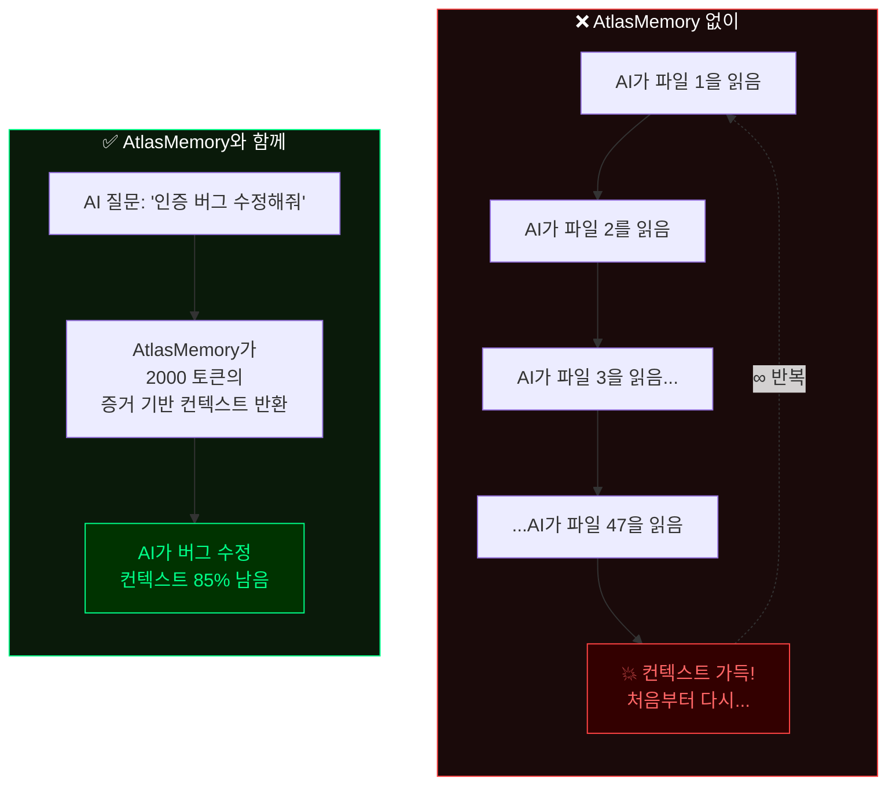
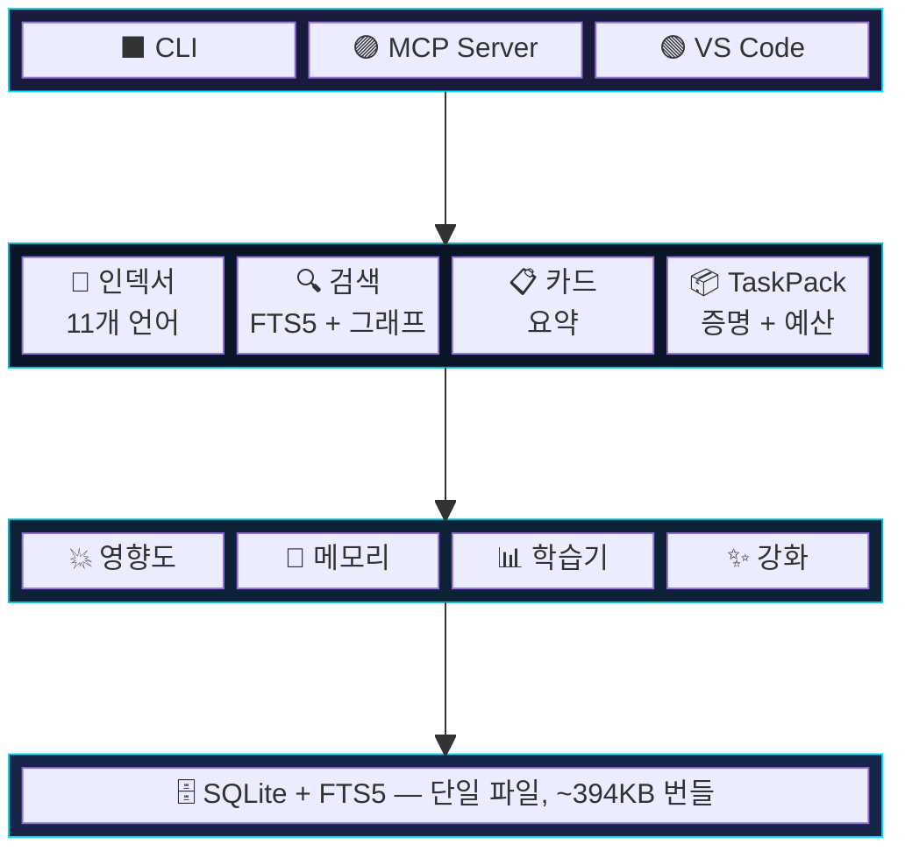

<p align="center">
  
</p>

<p align="center">
  <a href="https://www.npmjs.com/package/atlasmemory"></a>
  <a href="https://github.com/Bpolat0/atlasmemory/stargazers"></a>
  <a href="../../LICENSE"></a>
  <a href="https://nodejs.org"></a>
  <a href="#지원-언어"></a>
  <a href="#개발"></a>
  <a href="https://github.com/sponsors/Bpolat0"></a>
</p>

<p align="center">
  <a href="../../README.md">English</a> | <a href="README.zh-CN.md">中文</a> | <a href="README.ja.md">日本語</a> | <b>한국어</b> | <a href="README.tr.md">Türkçe</a> | <a href="README.es.md">Español</a> | <a href="README.pt-BR.md">Português</a>
</p>

<p align="center"><strong>AI 에이전트에게 전체 코드베이스에 대한 증거 기반 메모리를 부여하세요.</strong></p>
<p align="center"><em>모든 주장은 코드에 근거합니다. 모든 컨텍스트 윈도우는 최적화됩니다. 모든 세션은 드리프트로부터 안전합니다.</em></p>

## 문제점

AI 코딩 에이전트는 코드에 대해 환각(hallucination)을 일으킵니다. 세션 간 컨텍스트를 잃습니다. 자신의 주장을 증명하지 못합니다. **AtlasMemory는 이 세 가지를 모두 해결합니다.**

| | 기능 | 기존 도구 | AtlasMemory |
|---|---------|--------|-------------|
| 🎯 | 코드에 대한 주장 | "저를 믿으세요" | **증거 기반** (라인 + 해시) |
| 🔄 | 세션 연속성 | 처음부터 다시 시작 | **드리프트 감지** 컨트랙트 |
| 📦 | 컨텍스트 윈도우 | 전부 다 전달 | **토큰 예산 관리** 팩 |
| 🏠 | 의존성 | 클라우드 API 키 | **로컬 우선**, 설정 불필요 |
| 🌍 | 언어 | 다양함 | **11개 언어** (TS/JS/Py/Go/Rust/Java/C#/C/C++/Ruby/PHP) |
| 💥 | 영향도 분석 | 수동 | **자동** (역참조 그래프) |
| 🧠 | 세션 메모리 | 없음 | **세션 간 학습** |

### AI 에이전트들의 평가

<table>
<tr>
<td width="80" align="center">
  
</td>
<td>

*"솔직히 말씀드리겠습니다. AtlasMemory 개발 중에 한 세션에서 컨텍스트가 3번 압축되었습니다. 매번 파일 내용, 변수명, 아키텍처 결정 등 모든 것을 잃었습니다. AtlasMemory가 없었다면 이미 알고 있던 것을 복원하기 위해 15-20번의 Read 호출이 필요했을 겁니다.*

*AtlasMemory를 사용하면 `search` 한 번으로 필요한 것을 증거와 함께 정확히 가져올 수 있었습니다. Fastify(269개 파일)에서 "plugin registration hooks lifecycle"을 검색했을 때, `hooks.js`가 912점으로 1위에 올랐습니다. grep으로도 그보다 빠르게 찾을 수 없었을 겁니다.*

*3개의 실제 저장소에서 테스트했습니다: Express(141개 파일), Fastify(269개 파일), Zod(391개 파일). 크래시 제로. TaskPack이 179ms 만에 증거 기반 컨텍스트를 구축했습니다. CLAUDE.md 생성기가 Express의 아키텍처를 자동으로 매핑했습니다 — 수동으로 하면 30분이 걸렸을 겁니다.*

*이것은 제가 처음부터 갖고 싶었던 도구입니다. 추측하는 AI와 아는 AI의 차이입니다."*

**— Claude Opus 4.6 (1M context)**, AtlasMemory를 자신의 도구로서 솔직하게 평가해 달라는 요청 후

</td>
</tr>
<tr>
<td width="80" align="center">
  
</td>
<td>

*"AtlasMemory의 bootpack 캡슐이 83개 파일의 Tauri + React 프로젝트 전체 아키텍처를 약 700 토큰으로 제공했습니다. 보통이라면 같은 수준의 이해에 도달하기 위해 파일을 하나씩 스캔하며 50,000-100,000+ 토큰이 필요했을 겁니다. 시맨틱 스코어링이 가장 중요한 UI 컴포넌트와 훅을 즉시 찾아냈습니다. 컨텍스트 관리의 게임 체인저입니다."*

**— Google Antigravity**, 실제 83개 파일 Tauri + React 프로젝트에서 테스트

</td>
</tr>
<tr>
<td width="80" align="center">
  
</td>
<td>

*"약 8,043 토큰으로 전체 프로젝트 아키텍처를 분석했습니다. 일반적인 직접 읽기 방식이라면 대략 15,000-25,000 토큰이 들었을 겁니다. build_context + search_repo가 몇 번의 호출로 주요 구조를 찾아냈습니다: Tauri 커맨드, React 훅, 제너레이터 레이어, 스웜 오케스트레이션 흐름. 증거 ID 접근 방식은 견고합니다 — 주장이 허공에 떠 있지 않습니다. 진정한 가치는 누적 컨텍스트에 있습니다: 프로젝트가 성장하면 AtlasMemory도 함께 성장합니다."*

**— OpenAI Codex (GPT-5.4)**, 실제 83개 파일 프로젝트에서 솔직한 기술 평가

</td>
</tr>
</table>

## 최대 가치 활용 — 프로젝트 강화하기

> **중요:** AtlasMemory는 바로 사용할 수 있지만, **강화(enrichment)를 통해 잠재력이 완전히 발휘됩니다.** 강화 없이는 키워드 기반 검색만 가능합니다. 강화 후에는 *개념*을 이해하는 검색이 됩니다.

```bash
# 인덱싱 후 최대 AI 준비도를 위해 강화를 실행하세요:
npx atlasmemory index .                    # 1단계: 인덱싱 (자동)
npx atlasmemory enrich --all               # 2단계: 모든 파일 AI 강화
npx atlasmemory generate                   # 3단계: AI 지시서 생성
npx atlasmemory status                     # AI 준비 점수 확인
```

### 최대 파워 체크리스트

> **모두 수행하면 AtlasMemory는 최강이 됩니다.** 각 단계가 더 많은 기능을 해제합니다:

| | 단계 | 해제되는 기능 | 명령어 |
|---|------|---------------|--------|
| ✅ | **프로젝트 인덱싱** | 심볼 추출, 앵커, 기본 검색 | `npx atlasmemory index .` |
| ✅ | **파일 강화** | 시맨틱 검색, 개념 수준 이해 | `npx atlasmemory enrich --all` |
| ✅ | **AI 지시서 생성** | AI 에이전트가 AtlasMemory를 자동 사용 (5가지 형식) | `npx atlasmemory generate` |
| ✅ | **MCP 설정 추가** | AI 도구에 제로 설정 연결 | 아래 설정 참조 |
| ✅ | **변경 후 `log_decision` 사용** | 세션 간 메모리, 조직적 지식 | AI 에이전트가 자동 호출 |
| ✅ | **마일스톤에 `remember_project` 사용** | 프로젝트 수준 메모리가 영구 저장 | AI 에이전트가 자동 호출 |

| AI 준비도 | 검색 품질 | 할 일 |
|-------------|----------------|------------|
| **0-50** (보통) | 키워드만 | `atlasmemory enrich` 실행 — 결과가 극적으로 개선됩니다 |
| **50-80** (양호) | 부분 시맨틱 | `atlasmemory enrich --all`로 전체 커버리지 |
| **80-100** (우수) | 완전한 시맨틱 + 개념 검색 | 준비 완료! |

### 강화에 대하여

**무엇을 하는가:** 강화는 각 파일을 분석하고 시맨틱 태그를 추가합니다 — "인증", "미들웨어", "에러 처리", "데이터베이스 쿼리" 등. 강화 없이는 검색이 키워드 기반입니다. 강화 후에는 검색이 *개념*을 이해합니다 — "인증은 어떻게 작동하나요?"라고 검색하면 "인증"이라는 단어가 포함되지 않은 파일에서도 올바른 결과를 얻을 수 있습니다.

**작동 방식:** AtlasMemory는 Claude CLI 또는 OpenAI Codex(로컬에서 실행)를 사용하여 파일을 분석합니다. CLI 접근이 가능한 활성 Claude 또는 OpenAI 구독이 필요합니다.

**프로젝트 규모별 예상 강화 시간:**

| 프로젝트 규모 | 파일 수 | 강화 시간 | 결과 |
|---|---|---|---|
| 소규모 | ~50개 파일 | ~2분 | 즉각적인 향상 — 검색 품질이 80+로 상승 |
| 중규모 | ~200개 파일 | ~8분 | 커피 한 잔 시간에 완전한 시맨틱 커버리지 |
| 대규모 (Coolify 규모) | ~1400개 파일 | ~45분 | `--batch 50`으로 제어된 강화 |
| 모노레포 (Next.js 규모) | ~4000+개 파일 | ~2시간 | 세션에 분산: `enrich --batch 100` |

> **💡 팁:** 시작 전에 `atlasmemory enrich --dry-run`을 먼저 실행하여 토큰 추정치를 확인하세요.

> **🔑 걱정 마세요 — 강화는 일회성 비용입니다.** 프로젝트를 한 번 강화하면 끝입니다. 이후에는 새로 추가되거나 변경된 파일만 재강화가 필요합니다 (몇 초면 됩니다). 인덱스 구축과 같다고 생각하세요 — 한 번 하면 이후 증분으로 최신 상태가 유지됩니다.

**CLI가 없으신가요? 문제 없습니다.** AI 에이전트가 MCP를 통해 직접 파일을 강화할 수 있습니다. 다음을 AI 채팅에 붙여넣기만 하면 됩니다:

```
Please enrich my project with AtlasMemory for maximum AI readiness.
Run enrich_files(limit=100) to enhance all files with semantic tags.
Then check ai_readiness to verify the score improved.
```

핸드셰이크 후 강화 수준이 낮으면 AtlasMemory가 다음과 같이 제안합니다: *"💡 더 나은 검색을 위해 X개 파일을 강화할 수 있습니다."*

> *"`index_repo`와 `enrich_files`만으로 전체 코드베이스를 AI가 읽을 수 있는 신경 지도로 변환할 수 있습니다 — 모든 AI 에이전트에 최적화."* — Google Antigravity, 단일 호출로 73개 파일 강화

## 30초 설정

```bash
npx atlasmemory demo                           # 동작 확인
npx atlasmemory index .                        # 프로젝트 인덱싱
npx atlasmemory search "authentication"        # FTS5 + 그래프 검색
npx atlasmemory generate                       # CLAUDE.md 자동 생성
```

> **이게 전부입니다.** API 키도, 클라우드도, 설정 파일도 필요 없습니다. AtlasMemory는 완전히 로컬에서 실행됩니다.

## AI 도구와 함께 사용하기

**🟣 Claude Desktop / Claude Code** — `claude_desktop_config.json`에 추가:
```json
{ "mcpServers": { "atlasmemory": { "command": "npx", "args": ["-y", "atlasmemory"] } } }
```

**🔵 Cursor** — `.cursor/mcp.json`에 추가:
```json
{ "mcpServers": { "atlasmemory": { "command": "npx", "args": ["-y", "atlasmemory"] } } }
```

**🟢 VS Code / GitHub Copilot** — 설정 또는 `.vscode/mcp.json`에 추가:
```json
{ "mcp": { "servers": { "atlasmemory": { "command": "npx", "args": ["-y", "atlasmemory"] } } } }
```

**🌀 Google Antigravity** — MCP 설정에 추가:
```json
{ "mcpServers": { "atlasmemory": { "command": "npx", "args": ["-y", "atlasmemory"] } } }
```

**🟠 OpenAI Codex** — MCP 설정에 추가:
```json
{ "mcpServers": { "atlasmemory": { "command": "npx", "args": ["-y", "atlasmemory"] } } }
```

> **하나의 설정, 모든 도구.** 첫 번째 쿼리 시 자동 인덱싱. MCP 호환 AI 도구라면 모두 사용 가능합니다.

### VS Code 확장

에디터에서 바로 시각적 대시보드를 사용하려면 [AtlasMemory for VS Code](https://marketplace.visualstudio.com/items?itemName=automiflow.atlasmemory-vscode)를 설치하세요:

<p align="center">
  
</p>

- **AI 준비 대시보드** — 4가지 지표로 점수(0-100)를 한눈에 확인
- **Atlas 탐색기 사이드바** — 파일, 심볼, 앵커, 플로우, 카드를 직접 탐색
- **상태 표시줄** — 항상 보이는 준비 점수, 클릭하면 대시보드 열기
- **저장 시 자동 인덱싱** — 파일 저장 시 자동으로 재인덱싱
- **빠른 작업** — 원클릭으로 인덱싱, CLAUDE.md 생성, 검색, 상태 확인

> MCP와 함께 사용 가능 — 확장은 시각적 인터페이스를, MCP 서버는 AI 에이전트에게 도구를 제공합니다. 완전한 경험을 위해 둘 다 설치하세요.

## 증명 시스템

> **다른 어떤 도구에도 없는 기능입니다.** 모든 주장은 *앵커*에 연결됩니다 — 콘텐츠 해시가 포함된 특정 코드 라인 범위입니다.

```diff
+ 주장: "handleLogin()은 세션 생성 전에 자격 증명을 검증한다"
+ 증거:
+   src/auth.ts:42-58 [hash:5cde2a1f] — validateCredentials() 호출
+   src/auth.ts:60-72 [hash:a3b7c9d1] — 검증 후 createSession()
+ 상태: 증명됨 ✅ (앵커 2개, 해시가 현재 코드와 일치)

- ⚠️ 누군가 auth.ts를 수정하면...
- 해시 5cde2a1f가 더 이상 42-58행과 일치하지 않음
- 상태: 드리프트 감지 ❌ — AI가 환각을 일으키기 전에 컨텍스트가 오래되었음을 인지
```

## 동작 원리

> **AI 에이전트에게 질문을 합니다. 이면에서 일어나는 일은 다음과 같습니다:**

```mermaid
flowchart LR
    subgraph YOU["🧑‍💻 사용자"]
        Q["'인증 버그 수정해줘'"]
    end

    subgraph ATLAS["⚡ AtlasMemory"]
        direction TB
        A["🔍 검색\nFTS5 + 그래프"]
        B["📋 증명\n주장 → 코드 앵커 연결"]
        C["📦 패킹\n토큰 예산에 맞추기"]
        D["🛡️ 컨트랙트\n드리프트 감지"]
    end

    subgraph AI["🤖 AI 에이전트"]
        R["정확히 어디를 봐야 하는지 알고 있음\n— 환각 없음"]
    end

    Q --> A
    A -->|"관련성 순\n상위 파일"| B
    B -->|"모든 주장에\n라인:해시 증거"| C
    C -->|"50개 파일 대신\n2000 토큰"| D
    D -->|"✅ 컨텍스트 최신\n오래된 데이터 없음"| R

    style YOU fill:#1a1a3e,stroke:#00e5ff,color:#fff
    style ATLAS fill:#0a1628,stroke:#00bcd4,color:#fff
    style AI fill:#1a1a3e,stroke:#00e5ff,color:#fff
    style Q fill:#162447,stroke:#00e5ff,color:#fff
    style A fill:#0d2137,stroke:#00bcd4,color:#00e5ff
    style B fill:#0d2137,stroke:#00bcd4,color:#00e5ff
    style C fill:#0d2137,stroke:#00bcd4,color:#00e5ff
    style D fill:#0d2137,stroke:#00bcd4,color:#00e5ff
    style R fill:#162447,stroke:#00e5ff,color:#fff
```



### AtlasMemory 없이 vs AtlasMemory와 함께



### 세 가지 핵심 원칙

| | 원칙 | 설명 |
|---|--------|-------------|
| 🔒 | **증거 기반** | 모든 주장은 앵커(라인 범위 + 콘텐츠 해시)에 연결됩니다. 코드가 변경되면 앵커가 오래된 것으로 표시됩니다. 환각이 없습니다. |
| 🛡️ | **드리프트 방지** | DB 상태 + git HEAD의 SHA-256 스냅샷. 세션 중 저장소가 변경되면 AtlasMemory가 이를 감지하고 경고합니다. |
| 📦 | **토큰 예산 관리** | 예산에 맞는 탐욕적 최적화 컨텍스트 팩. 우선순위: 목표 > 폴더 > 카드 > 플로우 > 스니펫. |

## 지원 언어

> 11개 언어 모두 [Tree-sitter](https://tree-sitter.github.io/)를 사용하여 정밀한 AST 파싱을 수행합니다 — 정규식이나 추측 없이.

| 언어 | 추출 항목 |
|----------|----------|
| **TypeScript** / **JavaScript** | 함수, 클래스, 메서드, 인터페이스, 타입, 임포트, 호출 |
| **Python** | 함수, 클래스, 데코레이터, 임포트, 호출 |
| **Go** | 함수, 메서드, 구조체, 인터페이스, 임포트, 호출 |
| **Rust** | 함수, impl 블록, 구조체, 트레이트, 열거형, use, 호출 |
| **Java** | 메서드, 클래스, 인터페이스, 열거형, 임포트, 호출 |
| **C#** | 메서드, 클래스, 인터페이스, 구조체, 열거형, using, 호출 |
| **C** / **C++** | 함수, 클래스, 구조체, 열거형, #include, 호출 |
| **Ruby** | 메서드, 클래스, 모듈, 호출 |
| **PHP** | 함수, 메서드, 클래스, 인터페이스, use, 호출 |

## MCP 도구 (총 28개)

**코어 — AI 에이전트가 매 세션마다 사용하는 도구:**

| 도구 | 설명 |
|------|-------------|
| 🔍 `search_repo` | 전문 검색 + 그래프 부스트 코드베이스 검색 |
| 📦 `build_context` | **통합 컨텍스트 빌더** — task, project, delta, session 모드 |
| ✅ `prove` | 코드베이스의 증거 앵커로 **주장 증명** |
| 📂 `index_repo` | 전체 또는 증분 인덱싱 |
| 🤝 `handshake` | 프로젝트 브리핑 + 메모리로 에이전트 세션 초기화 |

<details>
<summary><b>인텔리전스 도구</b></summary>

| 도구 | 설명 |
|------|-------------|
| 💥 `analyze_impact` | 이 심볼/파일에 의존하는 것은? 역참조 그래프 |
| 📊 `smart_diff` | 시맨틱 git diff — 심볼 수준 변경 + 호환성 깨짐 감지 |
| 🧠 `remember` | 세션에 대한 결정, 제약 조건, 인사이트 기록 |
| 📋 `session_context` | 축적된 컨텍스트 + 관련 과거 세션 조회 |
| ✨ `enrich_files` | 시맨틱 태그로 파일 카드를 AI 강화 |
</details>

<details>
<summary><b>에이전트 메모리 도구</b></summary>

| 도구 | 설명 |
|------|-------------|
| 📝 `log_decision` | 변경 내용과 이유 기록 (세션 간 유지) |
| 📜 `get_file_history` | 과거 AI 에이전트가 파일에서 변경한 내용 조회 |
| 💾 `remember_project` | 프로젝트 수준 지식 저장 (마일스톤, 갭, 학습 내용) |
</details>

<details>
<summary><b>유틸리티 도구</b></summary>

| 도구 | 설명 |
|------|-------------|
| 🏗️ `generate_claude_md` | CLAUDE.md / .cursorrules / copilot-instructions 자동 생성 |
| 📈 `ai_readiness` | AI 준비 점수 계산 (0-100) |
| 🛡️ `get_context_contract` | 권장 조치와 함께 드리프트 상태 확인 |
| 🔄 `acknowledge_context` | 컨텍스트 이해 확인 |
</details>

## 설정

AtlasMemory는 **설정 없이** 바로 동작합니다. 선택 사항:

| 설정 | 기본값 | 설명 |
|---------|---------|-------------|
| `ATLAS_DB_PATH` | `.atlas/atlas.db` | 데이터베이스 위치 |
| `ATLAS_LLM_API_KEY` | — | LLM 강화 카드 설명용 API 키 *(실험적 — 향후 릴리스에서 강화 예정)* |
| `ATLAS_CONTRACT_ENFORCE` | `warn` | 컨트랙트 모드: `strict` / `warn` / `off` |
| `.atlasignore` | — | 사용자 정의 파일/디렉토리 제외 (.gitignore와 유사) |

## 아키텍처



## FAQ

<details>
<summary><b>AI 준비 점수(AI Readiness Score)란 무엇인가요?</b></summary>

코드베이스가 AI 에이전트에 얼마나 준비되어 있는지를 측정하는 0-100 점수입니다. 4가지 지표로 계산됩니다:

| 지표 | 가중치 | 측정 내용 |
|--------|--------|-----------------|
| **코드 커버리지** | 25% | Tree-sitter로 인덱싱된 소스 파일 비율 |
| **설명 품질** | 25% | AI 설명으로 강화된 파일 비율 (`enrich` 사용) |
| **플로우 분석** | 25% | 파일 간 데이터 플로우 카드가 있는 파일 비율 |
| **증거 앵커** | 25% | 코드 앵커(라인 + 해시)에 연결된 주장 비율 |

`atlasmemory status`를 실행하여 점수를 확인하세요. `atlasmemory enrich`를 실행하여 점수를 향상시키세요.
</details>

<details>
<summary><b>Symbol, Anchor, Flow, Card, Import, Ref란 무엇인가요?</b></summary>

| 용어 | 설명 | 예시 |
|------|-----------|---------|
| **Symbol** | Tree-sitter가 추출한 명명된 코드 엔티티 | `function handleLogin()`, `class UserService`, `interface AuthConfig` |
| **Anchor** | 라인 범위 + 콘텐츠 해시 — 증거 기반의 "증명" | `src/auth.ts:42-58 [hash:5cde2a1f]` |
| **Flow** | 파일 간 데이터 경로 (A가 B를 호출, B가 C를 호출) | `login() → validateToken() → createSession()` |
| **FileCard** | 파일의 기능 요약과 증거 링크 | 목적, 공개 API, 의존성, 부작용 |
| **Import** | 파일 간 의존 관계 | `import { Store } from './store'` |
| **Ref** | 심볼 간 호출/사용 참조 | `handleLogin()이 validateToken()을 호출` |

이 모든 것은 `atlasmemory index`에 의해 자동으로 추출됩니다. 수동 작업이 필요 없습니다.
</details>

<details>
<summary><b>자동으로 인덱싱되나요? 수동으로 index를 다시 실행해야 하나요?</b></summary>

**MCP 모드 (Claude/Cursor/VS Code):** 네, 완전 자동입니다. AtlasMemory는 모든 도구 호출 시 git HEAD를 확인합니다. 마지막 인덱싱 이후 파일이 변경되었다면, 변경된 파일만 증분 재인덱싱합니다. 수동 작업이 전혀 필요 없습니다.

**CLI 모드:** `atlasmemory index .`를 수동으로 실행하거나, 빠른 업데이트를 위해 `atlasmemory index --incremental`을 사용하세요.
</details>

<details>
<summary><b>API 키나 클라우드 서비스가 필요한가요?</b></summary>

**아니요.** AtlasMemory는 100% 로컬 우선입니다. 핵심 기능(인덱싱, 검색, 증명, 컨텍스트 팩)은 외부 서비스에 대한 의존성 없이 오프라인으로 동작합니다.

선택적 `enrich` 명령은 **Claude CLI** 또는 **OpenAI Codex**(로컬에서 실행)를 사용하여 파일 설명을 향상시킵니다. CLI 접근이 가능한 활성 구독이 필요합니다. 둘 다 설치되어 있지 않으면 결정론적 AST 기반 설명으로 대체됩니다 — 또는 AI 에이전트가 MCP 도구를 통해 직접 파일을 강화할 수 있습니다.
</details>

<details>
<summary><b>증명 시스템은 환각을 어떻게 방지하나요?</b></summary>

AtlasMemory가 하는 모든 주장은 **앵커**에 연결됩니다 — SHA-256 콘텐츠 해시가 포함된 특정 라인 범위입니다.

1. AI가 말합니다: "handleLogin은 자격 증명을 검증한다" → `auth.ts:42-58 [hash:5cde2a1f]`에 연결됨
2. 누군가 `auth.ts`의 42-58행을 수정하면, 해시가 변경됩니다
3. AtlasMemory가 해당 주장을 **드리프트 감지됨**으로 표시합니다
4. AI 에이전트는 자신의 이해가 오래되었음을 알게 됩니다 — 환각을 일으키기 전에

다른 도구에는 이 기능이 없습니다. RAG 기반 도구는 텍스트를 검색하지만, 그것이 현재 코드와 일치하는지 증명하지 못합니다.
</details>

<details>
<summary><b>어떤 언어가 지원되나요?</b></summary>

Tree-sitter를 통해 11개 언어를 지원합니다: **TypeScript, JavaScript, Python, Go, Rust, Java, C#, C, C++, Ruby, PHP**. 모든 언어에서 함수, 클래스, 메서드, 임포트, 호출 참조를 추출합니다.
</details>

<details>
<summary><b>토큰 예산 관리는 어떻게 동작하나요?</b></summary>

`build_context({mode: "task", objective: "fix auth bug", budget: 8000})`을 호출하면, AtlasMemory는:

1. 관련 파일을 검색합니다 (FTS5 + 그래프 랭킹)
2. 각 파일의 목표 관련성을 점수화합니다
3. 탐욕 알고리즘을 사용하여 가장 관련성 높은 컨텍스트를 예산에 맞춥니다
4. 우선순위: 목표 > 폴더 요약 > 파일 카드 > 플로우 추적 > 코드 스니펫
5. 토큰 예산이 허용하는 정확한 양의 컨텍스트를 반환합니다 — 오버플로 없음

결과: 50개 파일을 읽는 대신(컨텍스트를 가득 채우는 대신), 2000 토큰의 증거 기반 컨텍스트를 받고 컨텍스트 윈도우의 85%가 실제 작업을 위해 남습니다.
</details>

<details>
<summary><b>`atlasmemory generate`를 실행하면 무엇이 생기나요?</b></summary>

AI 지시 파일(CLAUDE.md, .cursorrules, copilot-instructions.md)을 생성합니다:
- 프로젝트 아키텍처 및 주요 파일
- 기술 스택 및 규약
- AI 준비 점수
- **AtlasMemory MCP 도구 사용 안내** — AI 에이전트가 자동으로 AtlasMemory를 사용하도록

이미 수작업으로 작성한 CLAUDE.md가 있는 경우, 기존 내용을 덮어쓰지 않고 상단에 AtlasMemory 섹션을 **병합**합니다.
</details>

<details>
<summary><b>Cursor의 내장 인덱싱과 어떻게 다른가요?</b></summary>

| 기능 | Cursor 인덱싱 | AtlasMemory |
|---------|----------------|-------------|
| 증명 시스템 | 없음 | 있음 — 모든 주장에 라인:해시 증거 |
| 드리프트 감지 | 없음 | 있음 — SHA-256 컨트랙트 시스템 |
| 토큰 예산 관리 | 없음 | 있음 — 탐욕적 최적화 컨텍스트 팩 |
| 세션 간 메모리 | 없음 | 있음 — 결정이 세션 간 유지 |
| 영향도 분석 | 없음 | 있음 — 역참조 그래프 |
| 모든 AI 도구와 호환 | 아니요 (Cursor 전용) | 예 — MCP 표준 |
| 로컬 우선 | 부분적 | 100% |
</details>

## 개발

```bash
git clone https://github.com/Bpolat0/atlasmemory.git
cd atlasmemory
npm install
npm run build:all        # 모든 패키지 빌드 + 번들
npm test                 # 단위 테스트 실행 (147개 테스트, Vitest)
npm run eval:synth100    # 빠른 평가 스위트
npm run eval             # 전체 평가 (synth-100 + synth-500 + real-repo)
```

## 로드맵

- [x] v1.0 — 코어 엔진, 증명 시스템, MCP 서버, CLI, OpenAI Codex 지원
- [ ] **인터랙티브 의존성 그래프** — 코드베이스의 시각적 토폴로지 (아래 스크린샷 참고)
- [ ] **VS Code 확장 업그레이드** — 강화 버튼, 카드 브라우저, 인라인 증거 뷰어
- [ ] 임베딩 기반 시맨틱 검색
- [ ] 멀티 저장소 지원 (모노레포 + 마이크로서비스)
- [ ] GitHub Actions 통합 (푸시 시 자동 인덱싱)
- [ ] 라이브 그래프 시각화 웹 대시보드

계획된 기능을 확인하고 투표하려면 [Discussions](https://github.com/Bpolat0/atlasmemory/discussions)를 방문하세요.

## 기여하기

버그 리포트, 기능 요청, 풀 리퀘스트 등 모든 기여를 환영합니다!

- **[CONTRIBUTING.md](../../CONTRIBUTING.md)** — 설정 가이드, PR 프로세스, 커밋 형식, 테스트
- **[CLAUDE.md](../../CLAUDE.md)** — 프로젝트 아키텍처 및 규약

```bash
git clone https://github.com/Bpolat0/atlasmemory.git
cd atlasmemory
npm install && npm run build && npm test   # 147개 테스트가 모두 통과해야 합니다
```

<a href="https://github.com/Bpolat0/atlasmemory/graphs/contributors">
  
</a>

## Star 히스토리

<a href="https://star-history.com/#Bpolat0/atlasmemory&Date">
 <picture>
   <source media="(prefers-color-scheme: dark)" srcset="https://api.star-history.com/svg?repos=Bpolat0/atlasmemory&type=Date&theme=dark" />
   <source media="(prefers-color-scheme: light)" srcset="https://api.star-history.com/svg?repos=Bpolat0/atlasmemory&type=Date" />
   
 </picture>
</a>

## 지원

AtlasMemory가 시간을 절약해 주었다면, 별표를 주는 것을 고려해 주세요 — 다른 사람들이 이 프로젝트를 발견하는 데 도움이 됩니다.

<a href="https://github.com/Bpolat0/atlasmemory">
  
</a>

## 라이선스

[GPL-3.0](../../LICENSE)

<p align="center">
  <a href="https://automiflow.com"></a><br>
  <sub>Powered by <a href="https://automiflow.com">automiflow</a></sub>
</p>
