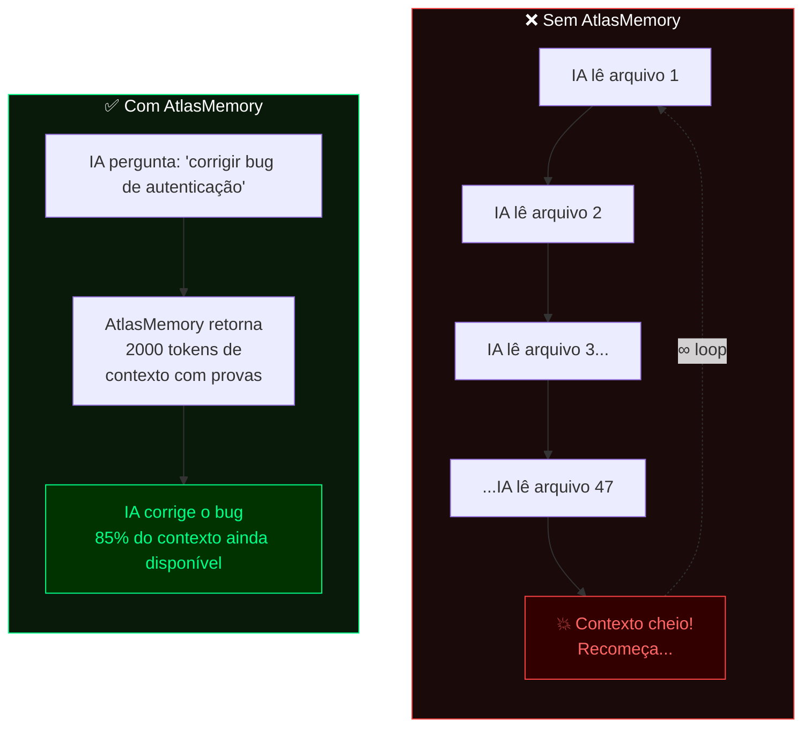
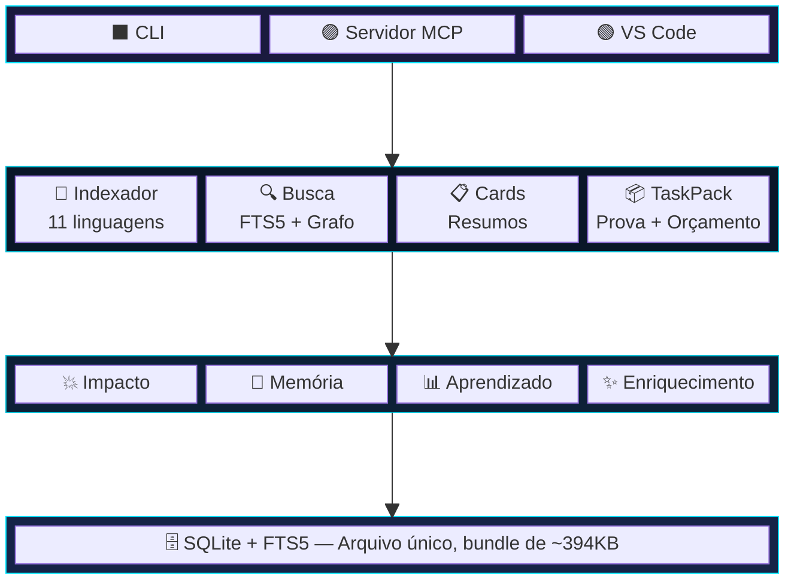

<p align="center">
  
</p>

<p align="center">
  <a href="https://www.npmjs.com/package/atlasmemory"></a>
  <a href="https://github.com/Bpolat0/atlasmemory/stargazers"></a>
  <a href="../../LICENSE"></a>
  <a href="https://nodejs.org"></a>
  <a href="#linguagens-suportadas"></a>
  <a href="#desenvolvimento"></a>
</p>

<p align="center">
  <a href="../../README.md">English</a> · <a href="README.zh-CN.md">中文</a> · <a href="README.ja.md">日本語</a> · <a href="README.ko.md">한국어</a> · <a href="README.tr.md">Türkçe</a> · <a href="README.es.md">Español</a> · <b>Português</b>
</p>

<p align="center"><strong>Dê ao seu agente de IA uma memória com provas de toda a sua base de código.</strong></p>
<p align="center"><em>Cada afirmação fundamentada em código. Cada janela de contexto otimizada. Cada sessão à prova de desvios.</em></p>

## O Problema

Agentes de IA para codificação alucinam sobre o seu código. Perdem o contexto entre sessões. Não conseguem provar suas afirmações. **O AtlasMemory resolve esses três problemas.**

| | Funcionalidade | Outros | AtlasMemory |
|---|---------|--------|-------------|
| 🎯 | Afirmações sobre código | "Confie em mim" | **Respaldado por provas** (linha + hash) |
| 🔄 | Continuidade de sessão | Recomeçar do zero | Contratos com **detecção de desvios** |
| 📦 | Janela de contexto | Despeja tudo | Pacotes com **orçamento de tokens** |
| 🏠 | Dependências | Chaves de API em nuvem | **Local-first**, zero configuração |
| 🌍 | Linguagens | Varia | **11 linguagens** (TS/JS/Py/Go/Rust/Java/C#/C/C++/Ruby/PHP) |
| 💥 | Análise de impacto | Manual | **Automática** (grafo de referência reversa) |
| 🧠 | Memória de sessão | Nenhuma | **Aprendizado entre sessões** |

## Configuração em 30 Segundos

```bash
npx atlasmemory demo                           # Veja em ação
npx atlasmemory index .                        # Indexe seu projeto
npx atlasmemory search "autenticação"          # Busca com FTS5 + grafo
npx atlasmemory generate                       # Gera automaticamente o CLAUDE.md
```

> **É só isso.** Sem chaves de API, sem nuvem, sem arquivos de configuração. O AtlasMemory roda inteiramente na sua máquina.

## Use com Sua Ferramenta de IA

**🟣 Claude Desktop / Claude Code** — adicione ao `claude_desktop_config.json`:
```json
{ "mcpServers": { "atlasmemory": { "command": "npx", "args": ["-y", "atlasmemory"], "cwd": "/caminho/para/seu/projeto" } } }
```

**🔵 Cursor** — adicione ao `.cursor/mcp.json`:
```json
{ "mcpServers": { "atlasmemory": { "command": "npx", "args": ["-y", "atlasmemory"] } } }
```

**🟢 VS Code** — adicione nas configurações:
```json
{ "mcp": { "servers": { "atlasmemory": { "command": "npx", "args": ["-y", "atlasmemory"] } } } }
```

> Indexação automática na primeira consulta. Zero configuração. Funciona com qualquer ferramenta de IA compatível com MCP.

## O Sistema de Provas

> **O que ninguém mais tem.** Cada afirmação é vinculada a uma *âncora* — um intervalo de linhas específico com um hash de conteúdo.

```diff
+ Afirmação: "handleLogin() valida credenciais antes de criar a sessão"
+ Evidência:
+   src/auth.ts:42-58 [hash:5cde2a1f] — chamada a validateCredentials()
+   src/auth.ts:60-72 [hash:a3b7c9d1] — createSession() após validação
+ Status: PROVADO ✅ (2 âncoras, hashes correspondem ao código atual)

- ⚠️ Alguém edita auth.ts...
- Hash 5cde2a1f não corresponde mais às linhas 42-58
- Status: DESVIO DETECTADO ❌ — IA sabe que o contexto está desatualizado ANTES de alucinar
```

## Como Funciona

> **Você faz uma pergunta ao seu agente de IA. Veja o que acontece nos bastidores:**

```mermaid
flowchart LR
    subgraph YOU["🧑‍💻 Você"]
        Q["'Corrija o bug de autenticação'"]
    end

    subgraph ATLAS["⚡ AtlasMemory"]
        direction TB
        A["🔍 Busca\nFTS5 + Grafo"]
        B["📋 Prova\nVincula afirmações → âncoras de código"]
        C["📦 Empacota\nAjusta ao orçamento de tokens"]
        D["🛡️ Contrato\nDetecta desvios"]
    end

    subgraph AI["🤖 Agente de IA"]
        R["Sabe exatamente onde procurar\n— sem alucinações"]
    end

    Q --> A
    A -->|"Principais arquivos\nordenados por relevância"| B
    B -->|"Cada afirmação tem\nevidência linha:hash"| C
    C -->|"2000 tokens em vez\nde ler 50 arquivos"| D
    D -->|"✅ Contexto atualizado\nsem dados obsoletos"| R

    style YOU fill:#1a1a3e,stroke:#00e5ff,color:#fff
    style ATLAS fill:#0a1628,stroke:#00bcd4,color:#fff
    style AI fill:#1a1a3e,stroke:#00e5ff,color:#fff
    style Q fill:#162447,stroke:#00e5ff,color:#fff
    style A fill:#0d2137,stroke:#00bcd4,color:#00e5ff
    style B fill:#0d2137,stroke:#00bcd4,color:#00e5ff
    style C fill:#0d2137,stroke:#00bcd4,color:#00e5ff
    style D fill:#0d2137,stroke:#00bcd4,color:#00e5ff
    style R fill:#162447,stroke:#00e5ff,color:#fff
```



### Sem AtlasMemory vs Com AtlasMemory



### Os Três Pilares

| | Pilar | O que faz |
|---|--------|-------------|
| 🔒 | **Respaldado por Provas** | Cada afirmação é vinculada a uma âncora (intervalo de linhas + hash de conteúdo). O código mudou? A âncora é marcada como obsoleta. Sem alucinações. |
| 🛡️ | **Resistente a Desvios** | Snapshots SHA-256 do estado do banco de dados + git HEAD. O repositório mudou durante a sessão? O AtlasMemory detecta e avisa. |
| 📦 | **Orçamento de Tokens** | Pacotes de contexto otimizados por algoritmo guloso que cabem no seu orçamento. Prioridade: objetivos > pastas > cards > fluxos > trechos de código. |

## Linguagens Suportadas

> Todas as 11 linguagens usam [Tree-sitter](https://tree-sitter.github.io/) para análise AST precisa — sem regex, sem adivinhação.

| Linguagem | Extrai |
|----------|----------|
| **TypeScript** / **JavaScript** | funções, classes, métodos, interfaces, tipos, imports, chamadas |
| **Python** | funções, classes, decoradores, imports, chamadas |
| **Go** | funções, métodos, structs, interfaces, imports, chamadas |
| **Rust** | funções, blocos impl, structs, traits, enums, use, chamadas |
| **Java** | métodos, classes, interfaces, enums, imports, chamadas |
| **C#** | métodos, classes, interfaces, structs, enums, using, chamadas |
| **C** / **C++** | funções, classes, structs, enums, #include, chamadas |
| **Ruby** | métodos, classes, módulos, chamadas |
| **PHP** | funções, métodos, classes, interfaces, use, chamadas |

## Ferramentas MCP (28 no total)

**Principais — o que seu agente de IA usa em cada sessão:**

| Ferramenta | Descrição |
|------|-------------|
| 🔍 `search_repo` | Busca na base de código com texto completo + reforço por grafo |
| 📦 `build_context` | **Construtor de contexto unificado** — modo task, project, delta ou session |
| ✅ `prove` | **Prove afirmações** com âncoras de evidência da sua base de código |
| 📂 `index_repo` | Indexação completa ou incremental |
| 🤝 `handshake` | Inicializa sessão do agente com briefing do projeto + memória |

<details>
<summary><b>Ferramentas de Inteligência</b></summary>

| Ferramenta | Descrição |
|------|-------------|
| 💥 `analyze_impact` | Quem depende deste símbolo/arquivo? Grafo de referência reversa |
| 📊 `smart_diff` | Diff semântico do git — mudanças ao nível de símbolo + breaking changes |
| 🧠 `remember` | Registre decisões, restrições e insights para a sessão |
| 📋 `session_context` | Veja o contexto acumulado + sessões passadas relacionadas |
| ✨ `enrich_files` | Aprimoramento de cards de arquivo com IA e tags semânticas |
</details>

<details>
<summary><b>Ferramentas de Memória do Agente</b></summary>

| Ferramenta | Descrição |
|------|-------------|
| 📝 `log_decision` | Registre o que você alterou e por quê (persiste entre sessões) |
| 📜 `get_file_history` | Veja o que agentes de IA anteriores alteraram em um arquivo |
| 💾 `remember_project` | Armazene conhecimento no nível do projeto (marcos, lacunas, aprendizados) |
</details>

<details>
<summary><b>Ferramentas Utilitárias</b></summary>

| Ferramenta | Descrição |
|------|-------------|
| 🏗️ `generate_claude_md` | Gera automaticamente CLAUDE.md / .cursorrules / copilot-instructions |
| 📈 `ai_readiness` | Calcula a Pontuação de Prontidão para IA (0-100) |
| 🛡️ `get_context_contract` | Verifica status de desvio com ações recomendadas |
| 🔄 `acknowledge_context` | Confirma que o contexto foi compreendido |
</details>

## Configuração

O AtlasMemory funciona com **zero configuração**. Opcionalmente:

| Configuração | Padrão | Descrição |
|---------|---------|-------------|
| `ATLAS_DB_PATH` | `.atlas/atlas.db` | Localização do banco de dados |
| `ATLAS_LLM_API_KEY` | — | Chave de API para descrições de cards aprimoradas por LLM |
| `ATLAS_CONTRACT_ENFORCE` | `warn` | Modo de contrato: `strict` / `warn` / `off` |
| `.atlasignore` | — | Exclusões personalizadas de arquivos/diretórios (como .gitignore) |

## Arquitetura



## Perguntas Frequentes

<details>
<summary><b>O que é a Pontuação de Prontidão para IA?</b></summary>

Uma pontuação de 0 a 100 que mede o quão preparada sua base de código está para agentes de IA. É calculada a partir de 4 métricas:

| Métrica | Peso | O que mede |
|--------|--------|-----------------|
| **Cobertura de Código** | 25% | % de arquivos fonte indexados pelo Tree-sitter |
| **Qualidade das Descrições** | 25% | % de arquivos com descrições de IA aprimoradas (via `enrich`) |
| **Análise de Fluxo** | 25% | % de arquivos com cards de fluxo de dados entre arquivos |
| **Âncoras de Evidência** | 25% | % de afirmações vinculadas a âncoras de código (linha + hash) |

Execute `atlasmemory status` para ver sua pontuação. Execute `atlasmemory enrich` para melhorá-la.
</details>

<details>
<summary><b>O que são Símbolos, Âncoras, Fluxos, Cards, Imports e Referências?</b></summary>

| Termo | O que é | Exemplo |
|------|-----------|---------|
| **Símbolo** | Uma entidade de código nomeada extraída pelo Tree-sitter | `function handleLogin()`, `class UserService`, `interface AuthConfig` |
| **Âncora** | Um intervalo de linhas + hash de conteúdo — a "prova" no respaldo por provas | `src/auth.ts:42-58 [hash:5cde2a1f]` |
| **Fluxo** | Um caminho de dados entre arquivos (A chama B chama C) | `login() → validateToken() → createSession()` |
| **FileCard** | Um resumo do que um arquivo faz, com links de evidência | Propósito, API pública, dependências, efeitos colaterais |
| **Import** | Uma relação de dependência entre arquivos | `import { Store } from './store'` |
| **Ref** | Uma referência de chamada/uso entre símbolos | `handleLogin() chama validateToken()` |

Tudo isso é extraído automaticamente pelo `atlasmemory index`. Nenhum trabalho manual necessário.
</details>

<details>
<summary><b>Ele indexa automaticamente? Preciso rodar o index manualmente?</b></summary>

**Modo MCP (Claude/Cursor/VS Code):** Sim, totalmente automático. O AtlasMemory verifica o git HEAD a cada chamada de ferramenta. Se os arquivos mudaram desde a última indexação, ele reindexa incrementalmente apenas os arquivos alterados. Zero trabalho manual.

**Modo CLI:** Execute `atlasmemory index .` manualmente, ou use `atlasmemory index --incremental` para atualizações rápidas.
</details>

<details>
<summary><b>Precisa de chave de API ou serviço em nuvem?</b></summary>

**Não.** O AtlasMemory é 100% local-first. As funcionalidades principais (indexação, busca, provas, pacotes de contexto) funcionam offline sem nenhuma dependência de serviços externos.

O comando opcional `enrich` usa o **Claude CLI** (gratuito, local) ou o **OpenAI Codex** (gratuito, local) para aprimorar as descrições de arquivos. Se nenhum estiver instalado, ele recorre a descrições determinísticas baseadas em AST — ainda funcionais, apenas menos detalhadas.
</details>

<details>
<summary><b>Como o sistema de provas previne alucinações?</b></summary>

Cada afirmação que o AtlasMemory faz é vinculada a uma **âncora** — um intervalo de linhas específico com um hash de conteúdo SHA-256.

1. A IA diz: "handleLogin valida credenciais" → vinculado a `auth.ts:42-58 [hash:5cde2a1f]`
2. Se alguém editar `auth.ts` linhas 42-58, o hash muda
3. O AtlasMemory marca a afirmação como **DESVIO DETECTADO**
4. O agente de IA sabe que seu entendimento está desatualizado — antes de alucinar

Nenhuma outra ferramenta faz isso. Ferramentas baseadas em RAG recuperam texto, mas não conseguem provar que ele corresponde ao código atual.
</details>

<details>
<summary><b>Quais linguagens são suportadas?</b></summary>

11 linguagens via Tree-sitter: **TypeScript, JavaScript, Python, Go, Rust, Java, C#, C, C++, Ruby, PHP**. Todas extraem funções, classes, métodos, imports e referências de chamada.
</details>

<details>
<summary><b>Como funciona o orçamento de tokens?</b></summary>

Quando você chama `build_context({mode: "task", objective: "corrigir bug de autenticação", budget: 8000})`, o AtlasMemory:

1. Busca arquivos relevantes (ranking FTS5 + grafo)
2. Pontua cada arquivo pela relevância ao seu objetivo
3. Usa um algoritmo guloso para empacotar o contexto mais relevante dentro do seu orçamento
4. Ordem de prioridade: objetivos > resumos de pastas > cards de arquivos > traços de fluxo > trechos de código
5. Retorna exatamente a quantidade de contexto que seu orçamento de tokens permite — sem estourar

Resultado: em vez de ler 50 arquivos (lotando seu contexto), você recebe 2000 tokens de contexto respaldado por provas com 85% da sua janela de contexto disponível para o trabalho real.
</details>

<details>
<summary><b>O que acontece quando eu executo `atlasmemory generate`?</b></summary>

Ele cria arquivos de instrução para IA (CLAUDE.md, .cursorrules, copilot-instructions.md) com:
- Arquitetura do projeto e arquivos-chave
- Stack tecnológica e convenções
- Pontuação de Prontidão para IA
- **Instruções de uso das ferramentas MCP do AtlasMemory** — para que seu agente de IA use automaticamente o AtlasMemory

Se você já tem um CLAUDE.md escrito manualmente, ele **mescla** a seção do AtlasMemory no topo sem sobrescrever seu conteúdo.
</details>

<details>
<summary><b>Como isso é diferente da indexação nativa do Cursor?</b></summary>

| Funcionalidade | Indexação do Cursor | AtlasMemory |
|---------|----------------|-------------|
| Sistema de provas | Não | Sim — cada afirmação tem evidência linha:hash |
| Detecção de desvios | Não | Sim — sistema de contratos SHA-256 |
| Orçamento de tokens | Não | Sim — pacotes de contexto otimizados por algoritmo guloso |
| Memória entre sessões | Não | Sim — decisões persistem entre sessões |
| Análise de impacto | Não | Sim — grafo de referência reversa |
| Funciona com qualquer ferramenta de IA | Não (apenas Cursor) | Sim — padrão MCP |
| Local-first | Parcial | 100% |
</details>

## Desenvolvimento

```bash
git clone https://github.com/Bpolat0/atlasmemory.git
cd atlasmemory
npm install
npm run build:all        # Compila todos os pacotes + bundle
npm test                 # Executa testes unitários (147 testes, Vitest)
npm run eval:synth100    # Suite de avaliação rápida
npm run eval             # Avaliação completa (synth-100 + synth-500 + real-repo)
```

## Roteiro

- [x] v1.0 — Motor principal, sistema de provas, servidor MCP, CLI, suporte a OpenAI Codex
- [ ] **Grafo de dependências interativo** — topologia visual da sua base de código (como a captura de tela abaixo)
- [ ] **Upgrade da extensão VS Code** — botão de enriquecimento, navegador de cards, visualizador de evidências inline
- [ ] Busca semântica com embeddings
- [ ] Suporte a múltiplos repositórios (monorepo + microsserviços)
- [ ] Integração com GitHub Actions (indexação automática no push)
- [ ] Dashboard web com visualização de grafo ao vivo

Veja o que está planejado e vote em funcionalidades em [Discussions](https://github.com/Bpolat0/atlasmemory/discussions).

## Contribuindo

Contribuições são bem-vindas! Seja relatórios de bugs, solicitações de funcionalidades ou pull requests.

- **[CONTRIBUTING.md](../../CONTRIBUTING.md)** — Guia de configuração, processo de PR, formato de commits, testes
- **[CLAUDE.md](../../CLAUDE.md)** — Arquitetura e convenções do projeto

```bash
git clone https://github.com/Bpolat0/atlasmemory.git
cd atlasmemory
npm install && npm run build && npm test   # 147 testes devem passar
```

<a href="https://github.com/Bpolat0/atlasmemory/graphs/contributors">
  
</a>

## Histórico de Estrelas

<a href="https://star-history.com/#Bpolat0/atlasmemory&Date">
 <picture>
   <source media="(prefers-color-scheme: dark)" srcset="https://api.star-history.com/svg?repos=Bpolat0/atlasmemory&type=Date&theme=dark" />
   <source media="(prefers-color-scheme: light)" srcset="https://api.star-history.com/svg?repos=Bpolat0/atlasmemory&type=Date" />
   
 </picture>
</a>

## Apoie

Se o AtlasMemory te economiza tempo, considere dar uma estrela — isso ajuda outras pessoas a descobrir o projeto.

<a href="https://github.com/Bpolat0/atlasmemory">
  
</a>

## Licença

[GPL-3.0](../../LICENSE)

<p align="center">
  <a href="https://automiflow.com"></a><br>
  <sub>Desenvolvido por <a href="https://automiflow.com">automiflow</a></sub>
</p>
