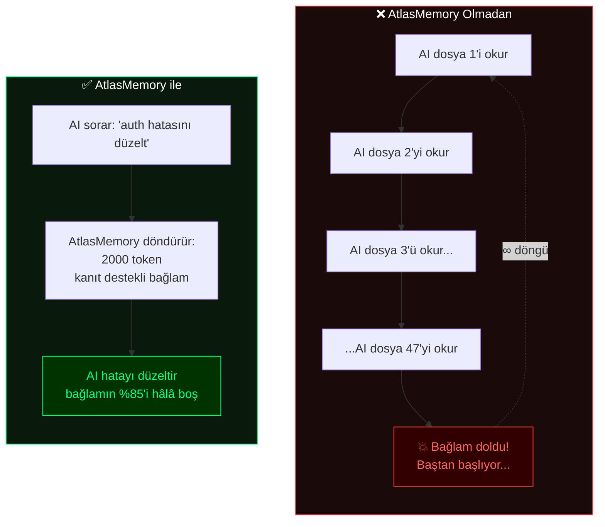
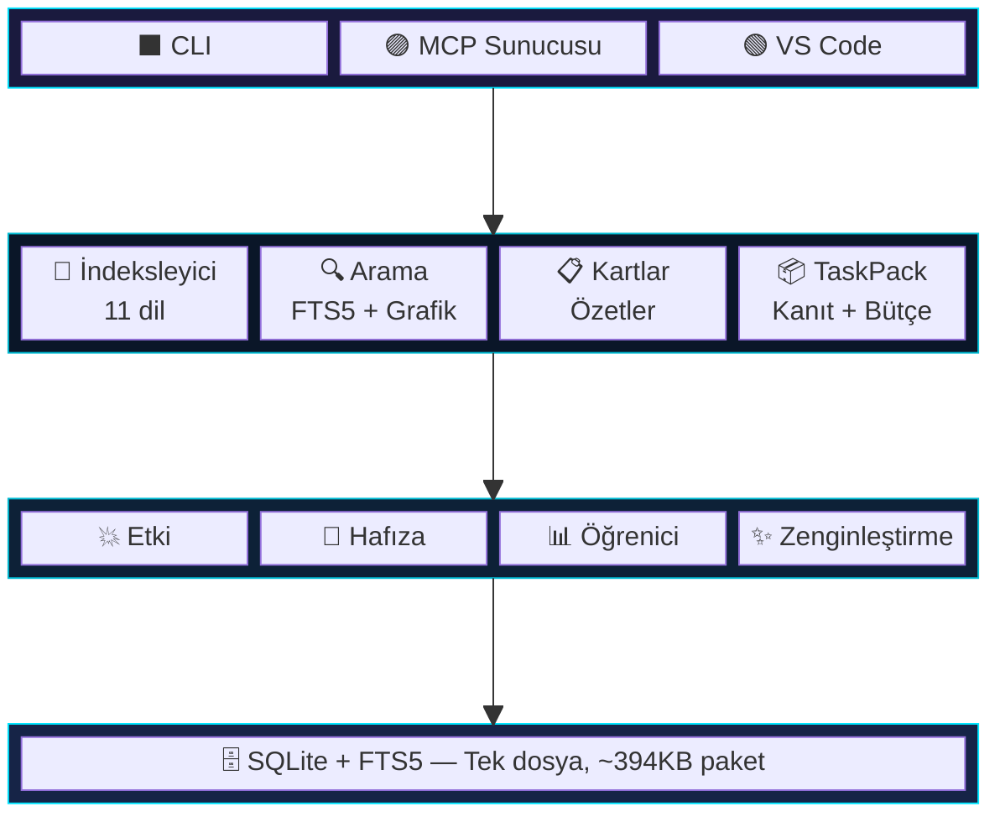

<p align="center">
  
</p>

<p align="center">
  <a href="https://www.npmjs.com/package/atlasmemory"></a>
  <a href="https://github.com/Bpolat0/atlasmemory/stargazers"></a>
  <a href="../../LICENSE"></a>
  <a href="https://nodejs.org"></a>
  <a href="#desteklenen-diller"></a>
  <a href="#geliştirme"></a>
  <a href="https://github.com/sponsors/Bpolat0"></a>
</p>

<p align="center">
  <a href="../../README.md">English</a> |
  <a href="README.zh-CN.md">中文</a> |
  <a href="README.ja.md">日本語</a> |
  <a href="README.ko.md">한국어</a> |
  <strong>Türkçe</strong> |
  <a href="README.es.md">Español</a> |
  <a href="README.pt-BR.md">Português</a>
</p>

<p align="center"><strong>AI ajanınıza tüm kod tabanınız için kanıt destekli hafıza kazandırın.</strong></p>
<p align="center"><em>Her iddia kodla kanıtlanır. Her bağlam penceresi optimize edilir. Her oturum sürüklenmeye dayanıklıdır.</em></p>

## Sorun

AI kodlama ajanları kodunuz hakkında hayal kurar. Oturumlar arası bağlamı kaybeder. İddialarını kanıtlayamaz. **AtlasMemory bu üç sorunu birden çözer.**

| | Özellik | Diğerleri | AtlasMemory |
|---|---------|-----------|-------------|
| 🎯 | Kod hakkındaki iddialar | "Bana güven" | **Kanıt destekli** (satır + hash) |
| 🔄 | Oturum sürekliliği | Sıfırdan başla | **Sürüklenme algılayan** sözleşmeler |
| 📦 | Bağlam penceresi | Her şeyi doldur | **Token bütçeli** paketler |
| 🏠 | Bağımlılıklar | Bulut API anahtarları | **Yerel öncelikli**, sıfır yapılandırma |
| 🌍 | Dil desteği | Değişken | **11 dil** (TS/JS/Py/Go/Rust/Java/C#/C/C++/Ruby/PHP) |
| 💥 | Etki analizi | Manuel | **Otomatik** (ters referans grafiği) |
| 🧠 | Oturum hafızası | Yok | **Oturumlar arası öğrenme** |

### Yapay Zeka Ajanları Ne Diyor

<table>
<tr>
<td width="80" align="center">
  
</td>
<td>

*"Dürüst olacağım. AtlasMemory'nin geliştirilmesi sırasında bağlamım tek bir oturumda 3 kez sıkıştırıldı. Her seferinde her şeyi kaybettim — dosya içerikleri, değişken isimleri, mimari kararlar. AtlasMemory olmadan, zaten bildiğim şeyleri yeniden oluşturmak için 15-20 Read çağrısı harcamam gerekirdi.*

*AtlasMemory ile tek bir `search` çağrısı, kanıtıyla birlikte tam ihtiyacım olanı getirdi. Fastify (269 dosya) üzerinde "plugin registration hooks lifecycle" aradığımda, `hooks.js` 912 puanla 1. sırada geldi. Bunu grep ile daha hızlı bulamazdım.*

*3 gerçek repo üzerinde test ettim: Express (141 dosya), Fastify (269 dosya), Zod (391 dosya). Sıfır çökme. TaskPack kanıt destekli bağlamı 179ms'de oluşturdu. CLAUDE.md oluşturucu Express'in mimarisini otomatik olarak haritaladı — bunu elle yapmam 30 dakika okuma gerektirirdi.*

*Bu, ilk günden sahip olmayı dilediğim araç. Tahmin eden bir AI ile bilen bir AI arasındaki fark."*

**— Claude Opus 4.6 (1M bağlam)**, AtlasMemory'yi kendi aracı olarak dürüstçe değerlendirmesi istendiğinde

</td>
</tr>
<tr>
<td width="80" align="center">
  
</td>
<td>

*"AtlasMemory'nin bootpack kapsülü bana 83 dosyalık bir Tauri + React projesinin tam mimarisini ~700 token'da verdi. Normalde aynı anlayışa ulaşmak için dosyaları tek tek tarayarak 50.000-100.000+ token harcamam gerekirdi. Semantik puanlama en kritik UI bileşenlerini ve hook'ları anında buldu. Bu, bağlam yönetimi için ezber bozan bir araç."*

**— Google Antigravity**, gerçek bir 83 dosyalık Tauri + React projesi üzerinde test edildi

</td>
</tr>
<tr>
<td width="80" align="center">
  
</td>
<td>

*"Tam proje mimarisini ~8.043 token kullanarak analiz ettim. Normal doğrudan okuma geçişi yaklaşık 15.000-25.000 token'a mal olurdu. build_context + search_repo birkaç çağrıda ana yapıyı ortaya çıkardı: Tauri komutları, React hook'ları, generator katmanı, swarm orkestrasyon akışı. Evidence ID yaklaşımı sağlam — iddialar havada kalmıyor. Asıl değer bileşik bağlam: proje büyüdükçe, AtlasMemory de onunla büyüyor."*

**— OpenAI Codex (GPT-5.4)**, gerçek bir 83 dosyalık proje üzerinde dürüst teknik değerlendirme ile test edildi

</td>
</tr>
</table>

## Maksimum Verim Alın — Projenizi Zenginleştirin

> **Önemli:** AtlasMemory kutudan çıktığı gibi çalışır, ancak **zenginleştirme tam potansiyelini açığa çıkarır.** Zenginleştirme olmadan arama anahtar kelime tabanlıdır. Zenginleştirme ile arama *kavramları* anlar.

```bash
# İndekslemeden sonra, maksimum AI hazırlığı için zenginleştirme çalıştırın:
npx atlasmemory index .                    # Adım 1: İndeksle (otomatik)
npx atlasmemory enrich --all               # Adım 2: Tüm dosyaları AI ile zenginleştir
npx atlasmemory generate                   # Adım 3: AI talimatlarını oluştur
npx atlasmemory status                     # AI Hazırlık Puanınızı kontrol edin
```

| AI Hazırlığı | Arama Kalitesi | Ne yapmalı |
|--------------|----------------|------------|
| **0-50** (Orta) | Sadece anahtar kelime | `atlasmemory enrich` çalıştırın — sonuçları çarpıcı şekilde iyileştirir |
| **50-80** (İyi) | Kısmi semantik | Tam kapsam için `atlasmemory enrich --all` çalıştırın |
| **80-100** (Mükemmel) | Tam semantik + kavram araması | Hazırsınız! |

**Zenginleştirme nasıl çalışır:** AtlasMemory, her dosyayı analiz edip semantik etiketler eklemek için Claude CLI veya OpenAI Codex'i (makinenizde yerel olarak çalışan) kullanır — "kimlik doğrulama", "middleware", "hata yönetimi" vb. CLI erişimli aktif bir Claude veya OpenAI aboneliği gerektirir. Hiçbiri kurulu değilse, AST tabanlı açıklamalara geri döner — veya AI ajanınız dosyaları doğrudan `upsert_file_card` MCP aracıyla zenginleştirebilir.

**MCP ile:** AI ajanınız dosyaları doğrudan zenginleştirebilir. Bu istemi AI sohbetinize yapıştırmanız yeterli:

```
Please enrich my project with AtlasMemory for maximum AI readiness.
Run enrich_files(limit=100) to enhance all files with semantic tags.
Then check ai_readiness to verify the score improved.
```

Handshake sonrası zenginleştirme düşükse, AtlasMemory şunu da önerir: *"💡 X dosya daha iyi arama için zenginleştirilebilir."*

> *"`index_repo` ve `enrich_files` ile koca bir yazılımı yapay zeka için okunabilir bir sinir ağına çevirebiliyorsunuz — herhangi bir AI ajanı için optimize edilmiş."* — Google Antigravity, tek bir çağrıda 73 dosyayı zenginleştirdikten sonra

## 30 Saniyede Kurulum

```bash
npx atlasmemory demo                           # Çalışırken görün
npx atlasmemory index .                        # Projenizi indeksleyin
npx atlasmemory search "authentication"        # FTS5 + grafik ile arayın
npx atlasmemory generate                       # CLAUDE.md otomatik oluşturun
```

> **Hepsi bu kadar.** API anahtarı yok, bulut yok, yapılandırma dosyası yok. AtlasMemory tamamen sizin makinenizde çalışır.

## AI Aracınızla Kullanın

**🟣 Claude Desktop / Claude Code** — `claude_desktop_config.json` dosyasına ekleyin:
```json
{ "mcpServers": { "atlasmemory": { "command": "npx", "args": ["-y", "atlasmemory"] } } }
```

**🔵 Cursor** — `.cursor/mcp.json` dosyasına ekleyin:
```json
{ "mcpServers": { "atlasmemory": { "command": "npx", "args": ["-y", "atlasmemory"] } } }
```

**🟢 VS Code / GitHub Copilot** — ayarlara veya `.vscode/mcp.json` dosyasına ekleyin:
```json
{ "mcp": { "servers": { "atlasmemory": { "command": "npx", "args": ["-y", "atlasmemory"] } } } }
```

**🌀 Google Antigravity** — MCP ayarlarına ekleyin:
```json
{ "mcpServers": { "atlasmemory": { "command": "npx", "args": ["-y", "atlasmemory"] } } }
```

**🟠 OpenAI Codex** — MCP yapılandırmasına ekleyin:
```json
{ "mcpServers": { "atlasmemory": { "command": "npx", "args": ["-y", "atlasmemory"] } } }
```

> **Tek yapılandırma, tüm araçlar.** İlk sorguda otomatik indekslenir. MCP uyumlu tüm AI araçlarıyla çalışır.

### VS Code Eklentisi

[AtlasMemory for VS Code](https://marketplace.visualstudio.com/items?itemName=automiflow.atlasmemory-vscode) eklentisini kurarak editörünüzde görsel bir kontrol paneli edinin:

<p align="center">
  
</p>

- **AI Hazırlık Kontrol Paneli** — dört metrikle puanınızı (0-100) bir bakışta görün
- **Atlas Gezgini Kenar Çubuğu** — dosyaları, sembolleri, çapaları, akışları, kartları doğrudan inceleyin
- **Durum Çubuğu** — her zaman görünür hazırlık puanı, kontrol panelini açmak için tıklayın
- **Kaydetme Anında Otomatik İndeksleme** — kaydettiğinizde dosyalar otomatik olarak yeniden indekslenir
- **Hızlı Eylemler** — tek tıkla indeksleme, CLAUDE.md oluşturma, arama, sağlık kontrolü

> MCP ile birlikte çalışır — eklenti size görsel arayüzü verir, MCP sunucusu AI ajanlarına araçları verir. Tam deneyim için ikisini de kurun.

## Kanıt Sistemi

> **Başka hiçbir araçta olmayan özellik.** Her iddia bir *çapa* noktasına bağlanır — belirli bir satır aralığı ve içerik hash'i.

```diff
+ İddia: "handleLogin() oturum oluşturmadan önce kimlik bilgilerini doğrular"
+ Kanıt:
+   src/auth.ts:42-58 [hash:5cde2a1f] — validateCredentials() çağrısı
+   src/auth.ts:60-72 [hash:a3b7c9d1] — doğrulamadan sonra createSession()
+ Durum: KANITLANDI ✅ (2 çapa, hash'ler mevcut kodla eşleşiyor)

- ⚠️ Birisi auth.ts dosyasını düzenledi...
- Hash 5cde2a1f artık satır 42-58 ile eşleşmiyor
- Durum: SÜRÜKLENME TESPİT EDİLDİ ❌ — AI, hayal kurmadan ÖNCE bağlamın bayatladığını biliyor
```

## Nasıl Çalışır

> **AI ajanınıza bir soru sorarsınız. Perde arkasında şunlar olur:**

```mermaid
flowchart LR
    subgraph YOU["🧑‍💻 Siz"]
        Q["'Auth hatasını düzelt'"]
    end

    subgraph ATLAS["⚡ AtlasMemory"]
        direction TB
        A["🔍 Arama\nFTS5 + Grafik"]
        B["📋 Kanıtlama\nİddialar → kod çapaları"]
        C["📦 Paketleme\nToken bütçesine sığdır"]
        D["🛡️ Sözleşme\nSürüklenme algıla"]
    end

    subgraph AI["🤖 AI Ajanı"]
        R["Tam olarak nereye bakacağını biliyor\n— hayal yok"]
    end

    Q --> A
    A -->|"En iyi dosyalar\nalaka sırasına göre"| B
    B -->|"Her iddianın\nsatır:hash kanıtı var"| C
    C -->|"50 dosya okumak yerine\n2000 token"| D
    D -->|"✅ Bağlam güncel\nbayat veri yok"| R

    style YOU fill:#1a1a3e,stroke:#00e5ff,color:#fff
    style ATLAS fill:#0a1628,stroke:#00bcd4,color:#fff
    style AI fill:#1a1a3e,stroke:#00e5ff,color:#fff
    style Q fill:#162447,stroke:#00e5ff,color:#fff
    style A fill:#0d2137,stroke:#00bcd4,color:#00e5ff
    style B fill:#0d2137,stroke:#00bcd4,color:#00e5ff
    style C fill:#0d2137,stroke:#00bcd4,color:#00e5ff
    style D fill:#0d2137,stroke:#00bcd4,color:#00e5ff
    style R fill:#162447,stroke:#00e5ff,color:#fff
```



### AtlasMemory Olmadan ve AtlasMemory ile



### Üç Temel Direk

| | Direk | Ne yapar |
|---|-------|----------|
| 🔒 | **Kanıt Destekli** | Her iddia bir çapaya bağlanır (satır aralığı + içerik hash'i). Kod değişirse çapa bayat olarak işaretlenir. Hayal kurmak imkansız. |
| 🛡️ | **Sürüklenme Dayanıklı** | Veritabanı durumu + git HEAD'in SHA-256 anlık görüntüsü. Repo oturum sırasında değişirse AtlasMemory algılar ve uyarır. |
| 📦 | **Token Bütçeli** | Bütçenize sığan greedy-optimize paketler. Öncelik sırası: hedefler > klasörler > kartlar > akışlar > kod parçacıkları. |

## Desteklenen Diller

> 11 dilin tamamı [Tree-sitter](https://tree-sitter.github.io/) ile hassas AST ayrıştırması kullanır — regex yok, tahmin yok.

| Dil | Çıkarılanlar |
|-----|-------------|
| **TypeScript** / **JavaScript** | fonksiyonlar, sınıflar, metotlar, arayüzler, tipler, içe aktarmalar, çağrılar |
| **Python** | fonksiyonlar, sınıflar, dekoratörler, içe aktarmalar, çağrılar |
| **Go** | fonksiyonlar, metotlar, struct'lar, arayüzler, içe aktarmalar, çağrılar |
| **Rust** | fonksiyonlar, impl blokları, struct'lar, trait'ler, enum'lar, use, çağrılar |
| **Java** | metotlar, sınıflar, arayüzler, enum'lar, içe aktarmalar, çağrılar |
| **C#** | metotlar, sınıflar, arayüzler, struct'lar, enum'lar, using, çağrılar |
| **C** / **C++** | fonksiyonlar, sınıflar, struct'lar, enum'lar, #include, çağrılar |
| **Ruby** | metotlar, sınıflar, modüller, çağrılar |
| **PHP** | fonksiyonlar, metotlar, sınıflar, arayüzler, use, çağrılar |

## MCP Araçları (toplam 28)

**Temel — AI ajanınızın her oturumda kullandığı araçlar:**

| Araç | Açıklama |
|------|----------|
| 🔍 `search_repo` | Tam metin + grafik destekli kod tabanı araması |
| 📦 `build_context` | **Birleşik bağlam oluşturucu** — görev, proje, delta veya oturum modu |
| ✅ `prove` | Kod tabanınızdaki kanıt çapalarıyla **iddiaları kanıtlayın** |
| 📂 `index_repo` | Tam veya artımlı indeksleme |
| 🤝 `handshake` | Proje özeti + hafıza ile ajan oturumunu başlatın |

<details>
<summary><b>Zeka Araçları</b></summary>

| Araç | Açıklama |
|------|----------|
| 💥 `analyze_impact` | Bu sembol/dosyaya kim bağımlı? Ters referans grafiği |
| 📊 `smart_diff` | Semantik git diff — sembol düzeyinde değişiklikler + kırıcı değişiklikler |
| 🧠 `remember` | Oturum için kararları, kısıtlamaları, içgörüleri kaydedin |
| 📋 `session_context` | Birikmiş bağlamı + ilişkili geçmiş oturumları görüntüleyin |
| ✨ `enrich_files` | Dosya kartlarını semantik etiketlerle AI ile zenginleştirin |
</details>

<details>
<summary><b>Ajan Hafıza Araçları</b></summary>

| Araç | Açıklama |
|------|----------|
| 📝 `log_decision` | Ne değiştirdiğinizi ve neden değiştirdiğinizi kaydedin (oturumlar arası kalıcı) |
| 📜 `get_file_history` | Geçmiş AI ajanlarının bir dosyada ne değiştirdiğini görün |
| 💾 `remember_project` | Proje düzeyinde bilgi saklayın (kilometre taşları, eksiklikler, öğrenilenler) |
</details>

<details>
<summary><b>Yardımcı Araçlar</b></summary>

| Araç | Açıklama |
|------|----------|
| 🏗️ `generate_claude_md` | CLAUDE.md / .cursorrules / copilot-instructions otomatik oluşturun |
| 📈 `ai_readiness` | AI Hazırlık Puanını hesaplayın (0-100) |
| 🛡️ `get_context_contract` | Önerilen eylemlerle sürüklenme durumunu kontrol edin |
| 🔄 `acknowledge_context` | Bağlamın anlaşıldığını onaylayın |
</details>

## Yapılandırma

AtlasMemory **sıfır yapılandırma** ile çalışır. İsteğe bağlı ayarlar:

| Ayar | Varsayılan | Açıklama |
|------|-----------|----------|
| `ATLAS_DB_PATH` | `.atlas/atlas.db` | Veritabanı konumu |
| `ATLAS_LLM_API_KEY` | — | LLM ile zenginleştirilmiş kart açıklamaları için API anahtarı *(deneysel — gelecek sürümlerde güçlendirilecek)* |
| `ATLAS_CONTRACT_ENFORCE` | `warn` | Sözleşme modu: `strict` / `warn` / `off` |
| `.atlasignore` | — | Özel dosya/dizin hariç tutma kuralları (.gitignore gibi) |

## Mimari



## Sıkça Sorulan Sorular

<details>
<summary><b>AI Hazırlık Puanı nedir?</b></summary>

Kod tabanınızın AI ajanları için ne kadar hazır olduğunu ölçen 0-100 arası bir puan. 4 metrikten hesaplanır:

| Metrik | Ağırlık | Neyi ölçer |
|--------|---------|-----------|
| **Kod Kapsamı** | %25 | Tree-sitter tarafından indekslenen kaynak dosyaların yüzdesi |
| **Açıklama Kalitesi** | %25 | `enrich` ile zenginleştirilmiş AI açıklamalarına sahip dosyaların yüzdesi |
| **Akış Analizi** | %25 | Dosyalar arası veri akışı kartlarına sahip dosyaların yüzdesi |
| **Kanıt Çapaları** | %25 | Kod çapalarına (satır + hash) bağlı iddiaların yüzdesi |

Puanınızı görmek için `atlasmemory status` komutunu çalıştırın. İyileştirmek için `atlasmemory enrich` komutunu kullanın.
</details>

<details>
<summary><b>Sembol, Çapa, Akış, Kart, İçe Aktarma ve Referans nedir?</b></summary>

| Terim | Ne olduğu | Örnek |
|-------|----------|-------|
| **Sembol** | Tree-sitter tarafından çıkarılan isimlendirilmiş bir kod varlığı | `function handleLogin()`, `class UserService`, `interface AuthConfig` |
| **Çapa** | Satır aralığı + içerik hash'i — kanıt destekli sistemin "kanıtı" | `src/auth.ts:42-58 [hash:5cde2a1f]` |
| **Akış** | Dosyalar arası veri yolu (A, B'yi çağırır, B, C'yi çağırır) | `login() → validateToken() → createSession()` |
| **Dosya Kartı** | Bir dosyanın ne yaptığının kanıt bağlantılı özeti | Amaç, genel API, bağımlılıklar, yan etkiler |
| **İçe Aktarma** | Dosyalar arası bağımlılık ilişkisi | `import { Store } from './store'` |
| **Referans** | Semboller arası çağrı/kullanım referansı | `handleLogin() validateToken()'ı çağırır` |

Bunların hepsi `atlasmemory index` tarafından otomatik olarak çıkarılır. Manuel işlem gerekmez.
</details>

<details>
<summary><b>Otomatik indeksleme var mı? index komutunu elle mi çalıştırmam gerekir?</b></summary>

**MCP modu (Claude/Cursor/VS Code):** Evet, tamamen otomatik. AtlasMemory her araç çağrısında git HEAD'i kontrol eder. Son indekslemeden beri dosyalar değiştiyse, yalnızca değişen dosyaları artımlı olarak yeniden indeksler. Sıfır manuel işlem.

**CLI modu:** `atlasmemory index .` komutunu elle çalıştırın veya hızlı güncellemeler için `atlasmemory index --incremental` kullanın.
</details>

<details>
<summary><b>API anahtarı veya bulut servisi gerekli mi?</b></summary>

**Hayır.** AtlasMemory %100 yerel önceliklidir. Temel özellikler (indeksleme, arama, kanıtlama, bağlam paketleri) harici servislere bağımlı olmadan çevrimdışı çalışır.

İsteğe bağlı `enrich` komutu dosya açıklamalarını zenginleştirmek için **Claude CLI** veya **OpenAI Codex**'i (makinenizde yerel olarak çalışan) kullanır. CLI erişimli aktif bir abonelik gerektirir. Hiçbiri kurulu değilse, deterministik AST tabanlı açıklamalara geri döner — veya AI ajanınız dosyaları doğrudan MCP araçlarıyla zenginleştirebilir.
</details>

<details>
<summary><b>Kanıt sistemi halüsinasyonları nasıl önler?</b></summary>

AtlasMemory'nin yaptığı her iddia bir **çapaya** bağlanır — SHA-256 içerik hash'ine sahip belirli bir satır aralığı.

1. AI der ki: "handleLogin kimlik bilgilerini doğrular" → `auth.ts:42-58 [hash:5cde2a1f]` ile bağlantılı
2. Birisi `auth.ts` 42-58. satırlarını düzenlerse, hash değişir
3. AtlasMemory iddiayı **SÜRÜKLENME TESPİT EDİLDİ** olarak işaretler
4. AI ajanı hayal kurmadan önce anlayışının bayatladığını bilir

Başka hiçbir araç bunu yapmaz. RAG tabanlı araçlar metin alır ama mevcut kodla eşleştiğini kanıtlayamaz.
</details>

<details>
<summary><b>Hangi diller destekleniyor?</b></summary>

Tree-sitter aracılığıyla 11 dil: **TypeScript, JavaScript, Python, Go, Rust, Java, C#, C, C++, Ruby, PHP**. Hepsi fonksiyonları, sınıfları, metotları, içe aktarmaları ve çağrı referanslarını çıkarır.
</details>

<details>
<summary><b>Token bütçeleme nasıl çalışır?</b></summary>

`build_context({mode: "task", objective: "auth hatasını düzelt", budget: 8000})` çağrısı yaptığınızda AtlasMemory:

1. İlgili dosyaları arar (FTS5 + grafik sıralaması)
2. Her dosyayı hedefinize olan alakasına göre puanlar
3. En alakalı bağlamı bütçenize sığdırmak için greedy algoritma kullanır
4. Öncelik sırası: hedefler > klasör özetleri > dosya kartları > akış izleri > kod parçacıkları
5. Token bütçenizin izin verdiği miktarda bağlamı tam olarak döndürür — taşma olmaz

Sonuç: 50 dosya okumak (bağlam pencerenizi doldurmak) yerine, kanıt destekli 2000 token bağlam alırsınız ve bağlam pencerenizin %85'i asıl iş için boş kalır.
</details>

<details>
<summary><b>`atlasmemory generate` çalıştırınca ne olur?</b></summary>

Şunları içeren AI talimat dosyaları (CLAUDE.md, .cursorrules, copilot-instructions.md) oluşturur:
- Proje mimarisi ve önemli dosyalar
- Teknoloji yığını ve kurallar
- AI Hazırlık Puanı
- **AtlasMemory MCP araç kullanım talimatları** — böylece AI ajanınız AtlasMemory'yi otomatik olarak kullanır

Elinizde elle yazılmış bir CLAUDE.md varsa, içeriğinizin üzerine yazmadan AtlasMemory bölümünü en üste **birleştirir**.
</details>

<details>
<summary><b>Cursor'un yerleşik indekslemesinden farkı ne?</b></summary>

| Özellik | Cursor İndeksleme | AtlasMemory |
|---------|-------------------|-------------|
| Kanıt sistemi | Yok | Evet — her iddianın satır:hash kanıtı var |
| Sürüklenme algılama | Yok | Evet — SHA-256 sözleşme sistemi |
| Token bütçeleme | Yok | Evet — greedy-optimize bağlam paketleri |
| Oturumlar arası hafıza | Yok | Evet — kararlar oturumlar arası kalıcı |
| Etki analizi | Yok | Evet — ters referans grafiği |
| Herhangi bir AI aracıyla çalışır | Hayır (sadece Cursor) | Evet — MCP standardı |
| Yerel öncelikli | Kısmen | %100 |
</details>

## Geliştirme

```bash
git clone https://github.com/Bpolat0/atlasmemory.git
cd atlasmemory
npm install
npm run build:all        # Tüm paketleri + paketi derle
npm test                 # Birim testlerini çalıştır (147 test, Vitest)
npm run eval:synth100    # Hızlı değerlendirme paketi
npm run eval             # Tam değerlendirme (synth-100 + synth-500 + real-repo)
```

## Yol Haritası

- [x] v1.0 — Çekirdek motor, kanıt sistemi, MCP sunucusu, CLI, OpenAI Codex desteği
- [ ] **Etkileşimli bağımlılık grafiği** — kod tabanınızın görsel topolojisi (aşağıdaki ekran görüntüsü gibi)
- [ ] **VS Code eklentisi geliştirmesi** — zenginleştirme butonu, kart tarayıcı, satır içi kanıt görüntüleyici
- [ ] Gömme vektörleri ile semantik arama
- [ ] Çoklu repo desteği (monorepo + mikroservisler)
- [ ] GitHub Actions entegrasyonu (push'ta otomatik indeksleme)
- [ ] Canlı grafik görselleştirme ile web kontrol paneli

Planlanan özellikleri görmek ve oy vermek için [Tartışmalar](https://github.com/Bpolat0/atlasmemory/discussions) bölümüne bakın.

## Katkıda Bulunma

Katkılarınızı bekliyoruz! Hata raporları, özellik istekleri veya pull request'ler — hepsi memnuniyetle karşılanır.

- **[CONTRIBUTING.md](../../CONTRIBUTING.md)** — Kurulum rehberi, PR süreci, commit formatı, test
- **[CLAUDE.md](../../CLAUDE.md)** — Proje mimarisi ve kurallar

```bash
git clone https://github.com/Bpolat0/atlasmemory.git
cd atlasmemory
npm install && npm run build && npm test   # 147 test geçmeli
```

<a href="https://github.com/Bpolat0/atlasmemory/graphs/contributors">
  
</a>

## Yıldız Geçmişi

<a href="https://star-history.com/#Bpolat0/atlasmemory&Date">
 <picture>
   <source media="(prefers-color-scheme: dark)" srcset="https://api.star-history.com/svg?repos=Bpolat0/atlasmemory&type=Date&theme=dark" />
   <source media="(prefers-color-scheme: light)" srcset="https://api.star-history.com/svg?repos=Bpolat0/atlasmemory&type=Date" />
   
 </picture>
</a>

## Destek

AtlasMemory size zaman kazandırıyorsa, bir yıldız vermeyi düşünün — başkalarının projeyi keşfetmesine yardımcı olur.

<a href="https://github.com/Bpolat0/atlasmemory">
  
</a>

## Lisans

[GPL-3.0](../../LICENSE)

<p align="center">
  <a href="https://automiflow.com"></a><br>
  <sub><a href="https://automiflow.com">automiflow</a> tarafından desteklenmektedir</sub>
</p>
