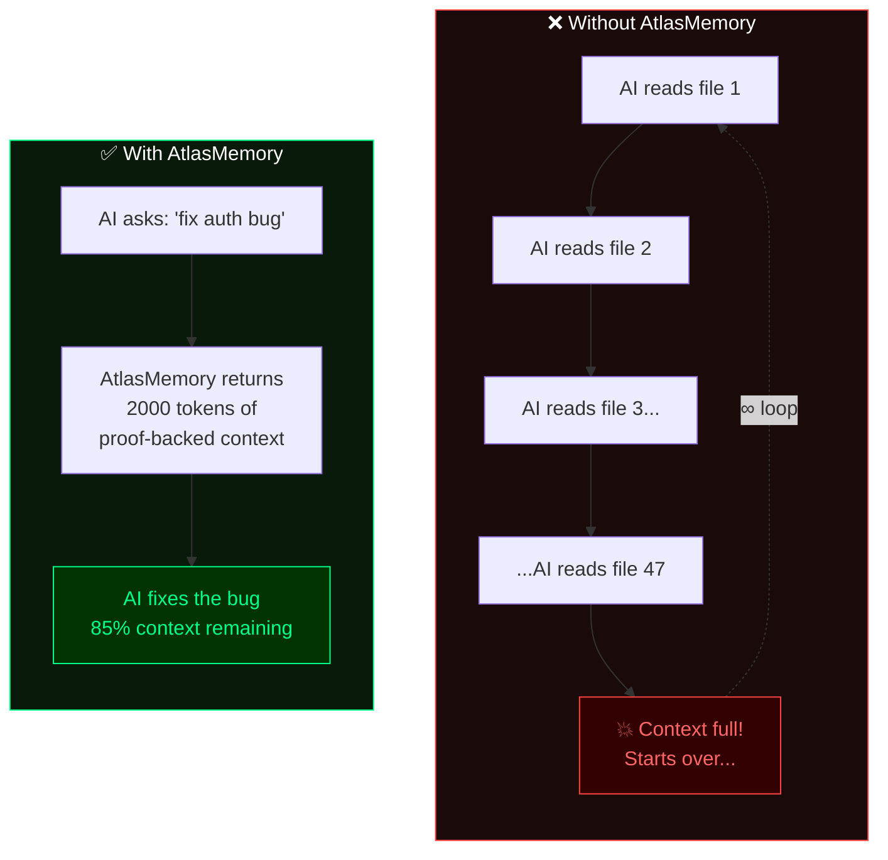
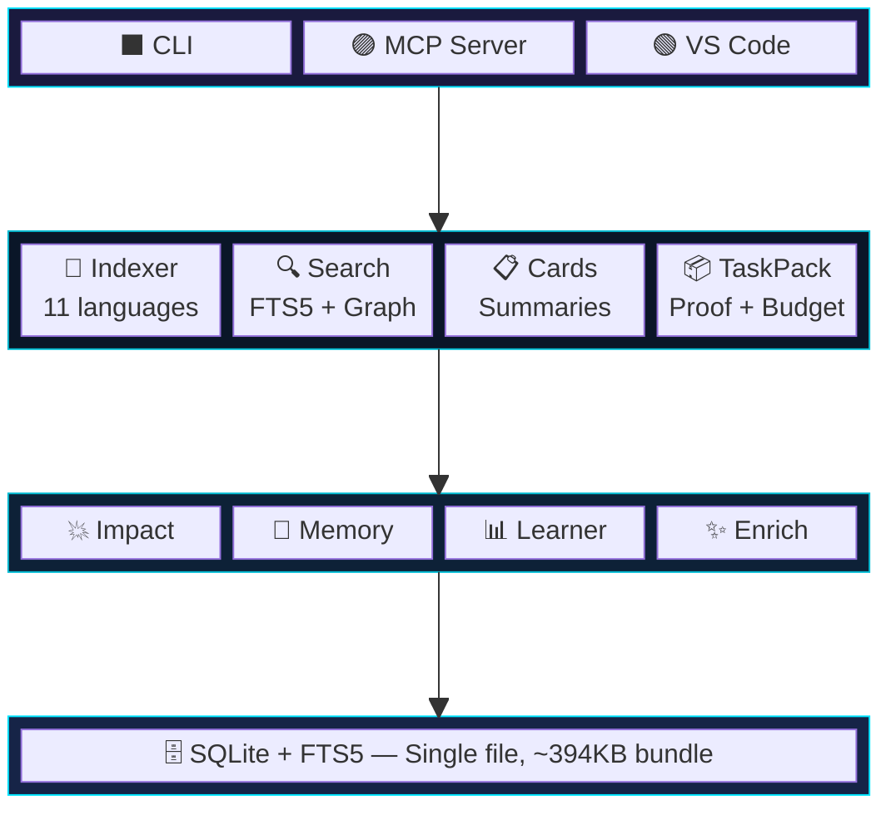

<p align="center">
  
</p>

<p align="center">
  <a href="https://www.npmjs.com/package/atlasmemory"></a>
  <a href="https://github.com/Bpolat0/atlasmemory/stargazers"></a>
  <a href="../../LICENSE"></a>
  <a href="https://nodejs.org"></a>
  <a href="#支持的语言"></a>
  <a href="#开发"></a>
  <a href="https://github.com/sponsors/Bpolat0"></a>
</p>

<p align="center">
  <a href="../../README.md">English</a> | <strong>中文</strong> | <a href="README.ja.md">日本語</a> | <a href="README.ko.md">한국어</a> | <a href="README.tr.md">Türkçe</a> | <a href="README.es.md">Español</a> | <a href="README.pt-BR.md">Português</a>
</p>

<p align="center"><strong>为你的 AI 智能体提供有证据支撑的全代码库记忆。</strong></p>
<p align="center"><em>每一个论断都有代码为证。每一个上下文窗口都经过优化。每一次会话都不会漂移。</em></p>

## 问题所在

AI 编程智能体会对你的代码产生幻觉。它们在不同会话之间会丢失上下文。它们无法证明自己的论断。**AtlasMemory 同时解决了这三个问题。**

| | 功能 | 其他工具 | AtlasMemory |
|---|---------|--------|-------------|
| 🎯 | 关于代码的论断 | "相信我" | **有证据支撑**（行号 + 哈希） |
| 🔄 | 会话连续性 | 从头开始 | **漂移检测**合约机制 |
| 📦 | 上下文窗口 | 全部堆入 | **Token 预算化**上下文包 |
| 🏠 | 外部依赖 | 需要云端 API 密钥 | **本地优先**，零配置 |
| 🌍 | 编程语言 | 各有不同 | **11 种语言**（TS/JS/Py/Go/Rust/Java/C#/C/C++/Ruby/PHP） |
| 💥 | 影响分析 | 手动操作 | **自动化**（反向引用图） |
| 🧠 | 会话记忆 | 无 | **跨会话学习** |

### AI 智能体们怎么说

<table>
<tr>
<td width="80" align="center">
  
</td>
<td>

*"说实话，在开发 AtlasMemory 的过程中，我的上下文在一次会话中被压缩了 3 次。每一次我都丢失了所有信息 — 文件内容、变量名、架构决策。如果没有 AtlasMemory，我需要 15-20 次 Read 调用才能重建我已经知道的内容。*

*有了 AtlasMemory，一次 `search` 调用就精准地返回了我需要的内容，并附带证据。当我在 Fastify（269 个文件）上搜索 "plugin registration hooks lifecycle" 时，`hooks.js` 以 912 的评分排在第 1 位。用 grep 我不可能更快地找到它。*

*我在 3 个真实仓库上进行了测试：Express（141 个文件）、Fastify（269 个文件）、Zod（391 个文件）。零崩溃。TaskPack 在 179ms 内构建了有证据支撑的上下文。CLAUDE.md 生成器自动映射了 Express 的架构 — 手动阅读的话我需要 30 分钟。*

*这是我从第一天起就希望拥有的工具。这就是一个靠猜测的 AI 和一个真正了解的 AI 之间的区别。"*

**— Claude Opus 4.6 (1M context)**，在被要求诚实评价 AtlasMemory 作为自己的工具时

</td>
</tr>
<tr>
<td width="80" align="center">
  
</td>
<td>

*"AtlasMemory 的 bootpack 胶囊用约 700 个 token 就让我完整理解了一个 83 文件的 Tauri + React 项目的架构。通常我需要逐个扫描文件，消耗 50,000-100,000+ 个 token 才能达到同样的理解程度。语义评分即时找到了最关键的 UI 组件和 hooks。这是上下文管理的革命性突破。"*

**— Google Antigravity**，在一个真实的 83 文件 Tauri + React 项目上测试

</td>
</tr>
<tr>
<td width="80" align="center">
  
</td>
<td>

*"我用约 8,043 个 token 分析了完整的项目架构。正常的直接读取方式大约需要 15,000-25,000 个 token。build_context + search_repo 仅用几次调用就呈现了主要结构：Tauri 命令、React hooks、生成器层、swarm 编排流程。Evidence ID 方法很扎实 — 论断不会悬而无据。真正的价值在于累积式上下文：随着项目增长，AtlasMemory 也随之增长。"*

**— OpenAI Codex (GPT-5.4)**，在一个真实的 83 文件项目上进行了诚实的技术评估

</td>
</tr>
</table>

## 发挥最大价值 — 增强你的项目

> **重要提示：** AtlasMemory 开箱即用，但**增强功能可以释放其全部潜力。**没有增强时，搜索基于关键词。有增强后，搜索能理解*概念*。

```bash
# 索引后，运行增强以获得最大 AI 就绪度：
npx atlasmemory index .                    # 第 1 步：索引（自动）
npx atlasmemory enrich --all               # 第 2 步：AI 增强所有文件
npx atlasmemory generate                   # 第 3 步：生成 AI 指令
npx atlasmemory status                     # 查看你的 AI 就绪度评分
```

| AI 就绪度 | 搜索质量 | 建议操作 |
|-------------|----------------|------------|
| **0-50**（一般） | 仅关键词匹配 | 运行 `atlasmemory enrich` — 将显著提升搜索效果 |
| **50-80**（良好） | 部分语义匹配 | 运行 `atlasmemory enrich --all` 实现全面覆盖 |
| **80-100**（优秀） | 完整语义 + 概念搜索 | 你已准备就绪！ |

**增强如何运作：** AtlasMemory 使用 Claude CLI 或 OpenAI Codex（在本地机器上运行）分析每个文件并添加语义标签 — "认证"、"中间件"、"错误处理"等。需要拥有 Claude 或 OpenAI 的有效订阅并开通 CLI 访问权限。如果两者都未安装，它会回退到基于 AST 的描述 — 或者你的 AI 智能体可以通过 `upsert_file_card` MCP 工具直接增强文件。

**通过 MCP：** 你的 AI 智能体可以直接增强文件。只需将以下提示粘贴到 AI 对话中：

```
Please enrich my project with AtlasMemory for maximum AI readiness.
Run enrich_files(limit=100) to enhance all files with semantic tags.
Then check ai_readiness to verify the score improved.
```

握手之后，如果增强程度较低，AtlasMemory 也会建议：*"💡 X 个文件可以被增强以获得更好的搜索效果。"*

> *"仅通过 `index_repo` 和 `enrich_files`，你就可以将整个代码库转变为 AI 可读的神经图谱 — 为任何 AI 代理优化。"* — Google Antigravity，单次调用丰富了 73 个文件

## 30 秒快速上手

```bash
npx atlasmemory demo                           # 查看演示效果
npx atlasmemory index .                        # 索引你的项目
npx atlasmemory search "authentication"        # 使用 FTS5 + 图搜索
npx atlasmemory generate                       # 自动生成 CLAUDE.md
```

> **就是这么简单。** 无需 API 密钥，无需云服务，无需配置文件。AtlasMemory 完全在本地运行。

## 配合你的 AI 工具使用

**🟣 Claude Desktop / Claude Code** — 添加到 `claude_desktop_config.json`：
```json
{ "mcpServers": { "atlasmemory": { "command": "npx", "args": ["-y", "atlasmemory"], "cwd": "/path/to/your/project" } } }
```

**🔵 Cursor** — 添加到 `.cursor/mcp.json`：
```json
{ "mcpServers": { "atlasmemory": { "command": "npx", "args": ["-y", "atlasmemory"] } } }
```

**🟢 VS Code / GitHub Copilot** — 添加到设置或 `.vscode/mcp.json`：
```json
{ "mcp": { "servers": { "atlasmemory": { "command": "npx", "args": ["-y", "atlasmemory"] } } } }
```

**🌀 Google Antigravity** — 添加到 MCP 设置：
```json
{ "mcpServers": { "atlasmemory": { "command": "npx", "args": ["-y", "atlasmemory"] } } }
```

**🟠 OpenAI Codex** — 添加到 MCP 配置：
```json
{ "mcpServers": { "atlasmemory": { "command": "npx", "args": ["-y", "atlasmemory"] } } }
```

> **一个配置，所有工具。** 首次查询时自动索引。兼容任何支持 MCP 协议的 AI 工具。

### VS Code 扩展

安装 [AtlasMemory for VS Code](https://marketplace.visualstudio.com/items?itemName=automiflow.atlasmemory-vscode)，直接在编辑器中使用可视化仪表盘：

<p align="center">
  
</p>

- **AI 就绪度仪表盘** — 一目了然地查看你的评分（0-100）及四项指标
- **Atlas 资源管理器侧边栏** — 直接浏览文件、符号、锚点、流程、卡片
- **状态栏** — 始终可见的就绪度评分，点击打开仪表盘
- **保存时自动索引** — 保存文件时自动重新索引
- **快捷操作** — 一键索引、生成 CLAUDE.md、搜索、健康检查

> 与 MCP 协同工作 — 扩展提供可视化界面，MCP 服务器为 AI 智能体提供工具。安装两者以获得完整体验。

## 证明系统

> **其他工具没有的能力。** 每一个论断都关联到一个*锚点* — 一个带有内容哈希的特定行范围。

```diff
+ 论断: "handleLogin() 在创建会话前会验证凭证"
+ 证据:
+   src/auth.ts:42-58 [hash:5cde2a1f] — validateCredentials() 调用
+   src/auth.ts:60-72 [hash:a3b7c9d1] — 验证后调用 createSession()
+ 状态: 已证明 ✅ (2 个锚点，哈希与当前代码匹配)

- ⚠️ 有人编辑了 auth.ts...
- 哈希 5cde2a1f 不再匹配第 42-58 行
- 状态: 检测到漂移 ❌ — AI 在产生幻觉之前就知道上下文已过时
```

## 工作原理

> **你向 AI 智能体提出问题。以下是幕后发生的事情：**

```mermaid
flowchart LR
    subgraph YOU["🧑‍💻 You"]
        Q["'Fix the auth bug'"]
    end

    subgraph ATLAS["⚡ AtlasMemory"]
        direction TB
        A["🔍 Search\nFTS5 + Graph"]
        B["📋 Prove\nLink claims → code anchors"]
        C["📦 Pack\nFit into token budget"]
        D["🛡️ Contract\nDetect drift"]
    end

    subgraph AI["🤖 AI Agent"]
        R["Knows exactly where to look\n— no hallucinations"]
    end

    Q --> A
    A -->|"Top files\nranked by relevance"| B
    B -->|"Every claim has\nline:hash evidence"| C
    C -->|"2000 tokens instead\nof reading 50 files"| D
    D -->|"✅ Context is fresh\nno stale data"| R

    style YOU fill:#1a1a3e,stroke:#00e5ff,color:#fff
    style ATLAS fill:#0a1628,stroke:#00bcd4,color:#fff
    style AI fill:#1a1a3e,stroke:#00e5ff,color:#fff
    style Q fill:#162447,stroke:#00e5ff,color:#fff
    style A fill:#0d2137,stroke:#00bcd4,color:#00e5ff
    style B fill:#0d2137,stroke:#00bcd4,color:#00e5ff
    style C fill:#0d2137,stroke:#00bcd4,color:#00e5ff
    style D fill:#0d2137,stroke:#00bcd4,color:#00e5ff
    style R fill:#162447,stroke:#00e5ff,color:#fff
```



### 没有 AtlasMemory vs 有 AtlasMemory



### 三大支柱

| | 支柱 | 功能说明 |
|---|--------|-------------|
| 🔒 | **有证据支撑** | 每个论断都关联到一个锚点（行范围 + 内容哈希）。代码发生变更？锚点标记为过时。杜绝幻觉。 |
| 🛡️ | **抗漂移** | 数据库状态 + git HEAD 的 SHA-256 快照。会话期间代码仓库发生变更？AtlasMemory 会检测并发出警告。 |
| 📦 | **Token 预算化** | 贪心算法优化的上下文包，精确适配你的预算。优先级：目标 > 文件夹 > 卡片 > 流程 > 代码片段。 |

## 支持的语言

> 所有 11 种语言均使用 [Tree-sitter](https://tree-sitter.github.io/) 进行精确的 AST 解析 — 不用正则，不靠猜测。

| 语言 | 提取内容 |
|----------|----------|
| **TypeScript** / **JavaScript** | 函数、类、方法、接口、类型、导入、调用 |
| **Python** | 函数、类、装饰器、导入、调用 |
| **Go** | 函数、方法、结构体、接口、导入、调用 |
| **Rust** | 函数、impl 块、结构体、trait、枚举、use、调用 |
| **Java** | 方法、类、接口、枚举、导入、调用 |
| **C#** | 方法、类、接口、结构体、枚举、using、调用 |
| **C** / **C++** | 函数、类、结构体、枚举、#include、调用 |
| **Ruby** | 方法、类、模块、调用 |
| **PHP** | 函数、方法、类、接口、use、调用 |

## MCP 工具（共 28 个）

**核心工具 — AI 智能体每次会话都会使用：**

| 工具 | 描述 |
|------|-------------|
| 🔍 `search_repo` | 全文检索 + 图增强的代码库搜索 |
| 📦 `build_context` | **统一上下文构建器** — 支持任务、项目、增量或会话模式 |
| ✅ `prove` | 用代码库中的证据锚点**证明论断** |
| 📂 `index_repo` | 全量或增量索引 |
| 🤝 `handshake` | 使用项目简报 + 记忆初始化智能体会话 |

<details>
<summary><b>智能工具</b></summary>

| 工具 | 描述 |
|------|-------------|
| 💥 `analyze_impact` | 谁依赖了这个符号/文件？反向引用图分析 |
| 📊 `smart_diff` | 语义化 git diff — 符号级变更 + 破坏性变更检测 |
| 🧠 `remember` | 记录会话中的决策、约束和洞察 |
| 📋 `session_context` | 查看累积的上下文 + 相关的历史会话 |
| ✨ `enrich_files` | 使用 AI 增强文件卡片的语义标签 |
</details>

<details>
<summary><b>智能体记忆工具</b></summary>

| 工具 | 描述 |
|------|-------------|
| 📝 `log_decision` | 记录你做了什么改动以及原因（跨会话持久化） |
| 📜 `get_file_history` | 查看过去的 AI 智能体对文件做了哪些修改 |
| 💾 `remember_project` | 存储项目级知识（里程碑、缺口、经验总结） |
</details>

<details>
<summary><b>实用工具</b></summary>

| 工具 | 描述 |
|------|-------------|
| 🏗️ `generate_claude_md` | 自动生成 CLAUDE.md / .cursorrules / copilot-instructions |
| 📈 `ai_readiness` | 计算 AI 就绪度评分（0-100） |
| 🛡️ `get_context_contract` | 检查漂移状态并提供推荐操作 |
| 🔄 `acknowledge_context` | 确认上下文已被理解 |
</details>

## 配置

AtlasMemory **无需任何配置**即可工作。以下为可选项：

| 设置项 | 默认值 | 描述 |
|---------|---------|-------------|
| `ATLAS_DB_PATH` | `.atlas/atlas.db` | 数据库位置 |
| `ATLAS_LLM_API_KEY` | — | 用于 LLM 增强卡片描述的 API 密钥 *(实验性 — 将在未来版本中增强)* |
| `ATLAS_CONTRACT_ENFORCE` | `warn` | 合约模式：`strict` / `warn` / `off` |
| `.atlasignore` | — | 自定义文件/目录排除规则（类似 .gitignore） |

## 架构



## 常见问题

<details>
<summary><b>什么是 AI 就绪度评分？</b></summary>

一个 0-100 的分数，衡量你的代码库为 AI 智能体准备得如何。它基于 4 个指标计算：

| 指标 | 权重 | 衡量内容 |
|--------|--------|-----------------|
| **代码覆盖率** | 25% | 被 Tree-sitter 索引的源文件百分比 |
| **描述质量** | 25% | 拥有 AI 增强描述的文件百分比（通过 `enrich`） |
| **流程分析** | 25% | 拥有跨文件数据流卡片的文件百分比 |
| **证据锚点** | 25% | 关联到代码锚点（行号 + 哈希）的论断百分比 |

运行 `atlasmemory status` 查看你的评分。运行 `atlasmemory enrich` 提升评分。
</details>

<details>
<summary><b>什么是 Symbol、Anchor、Flow、Card、Import 和 Ref？</b></summary>

| 术语 | 含义 | 示例 |
|------|-----------|---------|
| **Symbol（符号）** | 由 Tree-sitter 提取的命名代码实体 | `function handleLogin()`、`class UserService`、`interface AuthConfig` |
| **Anchor（锚点）** | 行范围 + 内容哈希 — "有证据支撑"中的"证据" | `src/auth.ts:42-58 [hash:5cde2a1f]` |
| **Flow（流程）** | 跨文件的数据路径（A 调用 B 调用 C） | `login() → validateToken() → createSession()` |
| **FileCard（文件卡片）** | 文件功能的摘要，附带证据链接 | 用途、公开 API、依赖关系、副作用 |
| **Import（导入）** | 文件之间的依赖关系 | `import { Store } from './store'` |
| **Ref（引用）** | 符号之间的调用/使用引用 | `handleLogin() calls validateToken()` |

这些全部由 `atlasmemory index` 自动提取。无需手动操作。
</details>

<details>
<summary><b>它会自动索引吗？我需要手动重新运行索引吗？</b></summary>

**MCP 模式（Claude/Cursor/VS Code）：** 是的，完全自动。AtlasMemory 在每次工具调用时检查 git HEAD。如果自上次索引以来文件发生了变更，它会仅对变更的文件进行增量重新索引。完全无需手动操作。

**CLI 模式：** 手动运行 `atlasmemory index .`，或使用 `atlasmemory index --incremental` 进行快速更新。
</details>

<details>
<summary><b>需要 API 密钥或云服务吗？</b></summary>

**不需要。** AtlasMemory 100% 本地优先。核心功能（索引、搜索、证明、上下文包）完全离线工作，不依赖任何外部服务。

可选的 `enrich` 命令使用 **Claude CLI** 或 **OpenAI Codex**（在本地运行）来增强文件描述。需要拥有有效订阅并开通 CLI 访问权限。如果两者都未安装，它会回退到基于 AST 的确定性描述 — 或者你的 AI 智能体可以通过 MCP 工具直接增强文件。
</details>

<details>
<summary><b>证明系统如何防止幻觉？</b></summary>

AtlasMemory 提出的每个论断都关联到一个**锚点** — 一个带有 SHA-256 内容哈希的特定行范围。

1. AI 说："handleLogin 会验证凭证" → 关联到 `auth.ts:42-58 [hash:5cde2a1f]`
2. 如果有人编辑了 `auth.ts` 的第 42-58 行，哈希值会改变
3. AtlasMemory 将该论断标记为**检测到漂移**
4. AI 智能体在产生幻觉之前就知道自己的理解已经过时

其他工具做不到这一点。基于 RAG 的工具能检索文本，但无法证明检索到的内容与当前代码匹配。
</details>

<details>
<summary><b>支持哪些编程语言？</b></summary>

通过 Tree-sitter 支持 11 种语言：**TypeScript、JavaScript、Python、Go、Rust、Java、C#、C、C++、Ruby、PHP**。所有语言均可提取函数、类、方法、导入和调用引用。
</details>

<details>
<summary><b>Token 预算化是如何工作的？</b></summary>

当你调用 `build_context({mode: "task", objective: "fix auth bug", budget: 8000})` 时，AtlasMemory 会：

1. 搜索相关文件（FTS5 + 图排序）
2. 根据与目标的相关性为每个文件评分
3. 使用贪心算法将最相关的上下文打包到你的预算中
4. 优先级顺序：目标 > 文件夹摘要 > 文件卡片 > 流程追踪 > 代码片段
5. 返回恰好符合你 token 预算的上下文量 — 不会溢出

结果：你不再需要读取 50 个文件（填满上下文），而是获得 2000 token 的有证据支撑的上下文，85% 的上下文窗口仍然可用于实际工作。
</details>

<details>
<summary><b>运行 `atlasmemory generate` 会发生什么？</b></summary>

它会创建 AI 指令文件（CLAUDE.md、.cursorrules、copilot-instructions.md），包含：
- 项目架构和关键文件
- 技术栈和编码规范
- AI 就绪度评分
- **AtlasMemory MCP 工具使用说明** — 让你的 AI 智能体自动使用 AtlasMemory

如果你已经有一个手写的 CLAUDE.md，它会将 AtlasMemory 部分**合并**到顶部，不会覆盖你的内容。
</details>

<details>
<summary><b>这与 Cursor 内置的索引有什么不同？</b></summary>

| 功能 | Cursor 索引 | AtlasMemory |
|---------|----------------|-------------|
| 证明系统 | 无 | 有 — 每个论断都有行号:哈希证据 |
| 漂移检测 | 无 | 有 — SHA-256 合约系统 |
| Token 预算化 | 无 | 有 — 贪心优化的上下文包 |
| 跨会话记忆 | 无 | 有 — 决策跨会话持久化 |
| 影响分析 | 无 | 有 — 反向引用图 |
| 兼容任何 AI 工具 | 否（仅限 Cursor） | 是 — MCP 标准协议 |
| 本地优先 | 部分 | 100% |
</details>

## 开发

```bash
git clone https://github.com/Bpolat0/atlasmemory.git
cd atlasmemory
npm install
npm run build:all        # 构建所有包 + 打包
npm test                 # 运行单元测试（147 个测试，Vitest）
npm run eval:synth100    # 快速评估套件
npm run eval             # 完整评估（synth-100 + synth-500 + real-repo）
```

## 路线图

- [x] v1.0 — 核心引擎、证明系统、MCP 服务器、CLI、OpenAI Codex 支持
- [ ] **交互式依赖图** — 代码库的可视化拓扑结构（如下方截图所示）
- [ ] **VS Code 扩展升级** — 增强按钮、卡片浏览器、内联证据查看器
- [ ] 基于嵌入向量的语义搜索
- [ ] 多仓库支持（monorepo + 微服务）
- [ ] GitHub Actions 集成（推送时自动索引）
- [ ] 带实时图可视化的 Web 仪表盘

查看计划中的功能并投票，请访问 [Discussions](https://github.com/Bpolat0/atlasmemory/discussions)。

## 参与贡献

我们欢迎各种形式的贡献！无论是错误报告、功能请求还是 Pull Request。

- **[CONTRIBUTING.md](../../CONTRIBUTING.md)** — 环境搭建指南、PR 流程、提交格式、测试要求
- **[CLAUDE.md](../../CLAUDE.md)** — 项目架构和编码规范

```bash
git clone https://github.com/Bpolat0/atlasmemory.git
cd atlasmemory
npm install && npm run build && npm test   # 147 个测试应全部通过
```

<a href="https://github.com/Bpolat0/atlasmemory/graphs/contributors">
  
</a>

## Star 历史

<a href="https://star-history.com/#Bpolat0/atlasmemory&Date">
 <picture>
   <source media="(prefers-color-scheme: dark)" srcset="https://api.star-history.com/svg?repos=Bpolat0/atlasmemory&type=Date&theme=dark" />
   <source media="(prefers-color-scheme: light)" srcset="https://api.star-history.com/svg?repos=Bpolat0/atlasmemory&type=Date" />
   
 </picture>
</a>

## 支持我们

如果 AtlasMemory 为你节省了时间，请考虑给它一个 Star — 这有助于更多人发现这个项目。

<a href="https://github.com/Bpolat0/atlasmemory">
  
</a>

## 许可证

[GPL-3.0](../../LICENSE)

<p align="center">
  <a href="https://automiflow.com"></a><br>
  <sub>Powered by <a href="https://automiflow.com">automiflow</a></sub>
</p>
